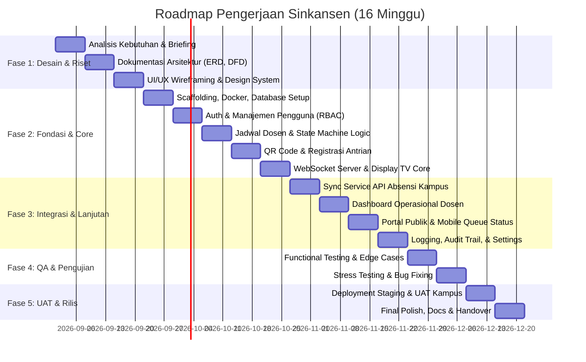

# 🏫 Sinkansen — Sistem Informasi Ketersediaan Dosen

> Aplikasi web mobile-friendly untuk memantau ketersediaan dosen secara real-time dan mengelola antrian konsultasi berbasis QR code.

---

## 👥 Tim Proyek

| Nama | Peran | Tanggung Jawab Utama |
|---|---|---|
| **Cahyadi Prasetyo** | Project Manager (PM) & Backend Developer (BE) | Manajemen proyek, arsitektur backend, REST API, WebSocket server, integrasi database & API absensi |
| **Elfa Dwi Cahyani** | Frontend Developer (FE) | Implementasi UI ke web app, client-side state management, integrasi REST API & WebSocket, display TV |
| **Meyza Zaharani** | UI & UX Designer | Riset pengguna, perancangan wireframe, user flow, dan UI design dashboard & display TV |
| **Laras Anditta P** | UI & UX Designer | Design system, visual asset, responsive mobile layout (landing page & registrasi antrian) |
| **Widuri Eka** | Quality Assurance (QA) | Test plan, manual & automated testing, edge-case validation, reporting bug, serta verifikasi UAT |

---

## 📋 Tentang Proyek

**Sinkansen** adalah sistem informasi ketersediaan dosen dan antrian konsultasi mahasiswa yang terinspirasi dari keandalan sistem antrian perbankan/rumah sakit, dirancang secara modular dan mobile-friendly untuk kebutuhan kampus.

### 🚀 Fitur yang Ingin Dikembangkan

#### 1. Fitur Utama (MVP Core)
- 🟢 **Live Status Ketersediaan Dosen** — Menampilkan status dosen secara otomatis (`TERSEDIA`, `MENGAJAR`, `TIDAK BERSEDIA`, `PULANG`).
- 🔗 **Integrasi API Absensi Kampus** — Sinkronisasi otomatis data tap masuk/pulang dosen via webhook & polling fallback.
- 📱 **Registrasi Antrian Cepat via QR Code** — Mahasiswa cukup scan QR harian dari layar TV kampus, mengisi form singkat tanpa registrasi akun yang rumit.
- 📺 **Display TV Kampus Real-time** — Papan informasi publik dinamis untuk display monitor/TV di lorong/ruang dosen: menampilkan status dosen dan nomor antrian yang sedang dipanggil lengkap dengan visual alert.
- ⚡ **WebSocket End-to-End** — Pembaruan status ketersediaan dan giliran antrian langsung ter-broadcast ke semua layar secara instan tanpa reload browser.
- 🎛️ **Dashboard Dosen & Operator** — Panel bagi dosen untuk mengelola jadwal, memanggil nomor antrian, dan melakukan override status jika ada urusan mendesak.
- 🛡️ **Role-Based Access Control (RBAC)** — Hak akses terstruktur untuk Superadmin, Admin Fakultas, Dosen, dan Operator.

#### 2. Fitur Lanjutan (Post-MVP / Roadmap Enhancement)
- 🔊 **Voice/Audio Chime Announcer** — Panggilan nomor antrian berbasis suara sintetis otomatis di Display TV (*"Nomor antrian A-05, silakan menuju..."*).
- 📲 **Estimasi Waktu Tunggu & Notifikasi Browser/PWA** — Informasi perkiraan waktu tunggu konsultasi di layar HP mahasiswa.
- 📊 **Laporan & Analitik Kinerja Konsultasi** — Statistik rata-rata durasi konsultasi, beban antrian per dosen/prodi, dan log kehadiran.
- 💬 **Feedback & Rating Singkat Konsultasi** — Survei kepuasan singkat setelah sesi konsultasi selesai.

---

## 🏛️ Pertimbangan Arsitektur

Arsitektur Sinkansen dirancang dengan mempertimbangkan keandalan, skalabilitas, dan kemudahan implementasi di lingkungan server kampus (*on-premise / private cloud*):

1. **Decoupled Client-Server & Monolith Modular**
   - Frontend dan Backend dipisahkan secara bersih via REST API (untuk transaksi data/CRUD) dan WebSocket (untuk event streaming).
   - Pendekatan ini memungkinkan Display TV, Portal Publik Mahasiswa, dan Dashboard Admin/Dosen menggunakan backend yang sama.

2. **Real-time Engine Berbasis WebSocket + Redis Pub/Sub**
   - Menghindari *heavy polling* dari ratusan client mahasiswa dan Display TV kampus.
   - Redis bertindak sebagai broker Pub/Sub untuk menyiarkan event status dan antrian ke banyak client secara instan dan efisien.

3. **Adapter Pattern untuk Integrasi Absensi Kampus**
   - Format API absensi kampus seringkali proprietary dan rentan berubah. Dengan pola *adapter*, sistem dapat mendukung skema Webhook maupun Scheduled Polling tanpa mengubah core business logic.

4. **Integritas Data & Penomoran Antrian (ACID Compliance)**
   - Menggunakan Relational Database (PostgreSQL) dengan transaksi terisolasi untuk memastikan nomor antrian sequential (`A-01`, `A-02`, dst.) per dosen per hari tidak mengalami *race condition* atau duplikasi.

5. **Container-Ready Deployment (Docker)**
   - Seluruh dependensi (App Server, PostgreSQL, Redis, Nginx) dibungkus dalam `docker-compose.yml` agar mudah di-deploy di infrastruktur kampus tanpa ketergantungan konfigurasi manual OS server.

```
┌─────────────────────────────────────────────────────────────┐
│                       Client Layer                          │
│   Web App (Admin/Dosen)  │  Landing Page  │  Display TV TV  │
└──────────────────────────────┬──────────────────────────────┘
                               │ HTTPS (REST) + WSS (WebSocket)
┌──────────────────────────────▼──────────────────────────────┐
│                    Application Gateway                      │
│                    Nginx Reverse Proxy                      │
└──────────────────────────────┬──────────────────────────────┘
                               │
┌──────────────────────────────▼──────────────────────────────┐
│                   Backend Services Layer                    │
│   ┌─────────────────────────────────────────────────────┐   │
│   │ REST API & WebSocket Controller                    │   │
│   ├─────────────────────────────────────────────────────┤   │
│   │ State Machine & Queue Service                       │   │
│   ├─────────────────────────────────────────────────────┤   │
│   │ Attendance Sync Service (Polling + Webhook)        │   │
│   ├─────────────────────────────────────────────────────┤   │
│   │ Task Scheduler (Cron reset antrian & expire QR)    │   │
│   └─────────────────────────────────────────────────────┘   │
└──────────────────┬───────────────────────────┬──────────────┘
                   │                           │
         ┌─────────▼─────────┐       ┌─────────▼─────────┐
         │ PostgreSQL (Data) │       │ Redis (Pub/Sub)   │
         └───────────────────┘       └───────────────────┘
```

---

## 🛠️ Kandidat Tech Stack

Berdasarkan kebutuhan responsivitas tinggi, kemudahan integrasi WebSocket, dan efisiensi tim:

| Komponen | Pilihan Utama (Recommended) | Alternatif Dipertimbangkan | Alasan Pemilihan |
|---|---|---|---|
| **Frontend Web** | **React.js / Next.js** (Tailwind CSS) | Vue.js / SvelteKit | Ekosistem kaya, performa tinggi untuk dashboard dinamis dan TV display |
| **Backend API** | **Node.js (NestJS / Express)** | Go (Fiber/Gin) atau Laravel 13 | Penanganan event I/O non-blocking dan WebSocket yang sangat matang |
| **Real-time Server** | **Socket.io / Native WS** | Pusher / Centrifugo | Kemudahan koneksi dua arah dengan fallback otomatis |
| **Database** | **PostgreSQL** | MySQL 8 | Keandalan ACID, indexing cepat, dan dukungan tipe data JSONB |
| **Cache & Pub/Sub** | **Redis** | In-memory store | Kecepatan broadcast channel WebSocket dan session caching |
| **UI/UX Design** | **Figma** | Penpot | Kolaborasi desain interaktif, pembuatan design system, dan prototipe |
| **Testing & QA** | **Postman, Jest/Vitest, Cypress** | Playwright | Testing endpoint REST API, unit testing logika antrian, dan UI flow |
| **DevOps / Infra** | **Docker & Docker Compose, Nginx** | Baremetal PM2 | Standarisasi environment staging dan production di server kampus |

---

## 🗓️ Timeline & Roadmap Pengerjaan (16 Minggu)

Proyek direncanakan berlangsung selama **16 minggu** dengan tahapan terstruktur dari riset hingga serah terima:



### Rincian Rencana Kerja Mingguan

| Minggu | Fase | Fokus Pengerjaan & Output | PIC Utama |
|---|---|---|---|
| **W1** | **Inisiasi & Riset** | Pengumpulan kebutuhan kampus, validasi aturan bisnis, penyusunan `PROJECT_BRIEF.md`. | PM, All |
| **W2** | **Arsitektur Sistem** | Pembuatan ERD detail 11 entitas, DFD Level 0 & 1, serta flowchart alur bisnis. | PM & BE |
| **W3** | **UI/UX Desain** | Pembuatan User Persona, Wireframe, Design System, dan High-Fidelity Mockup (Figma). | UI & UX |
| **W4** | **Setup Fondasi** | Setup repositori, dockerized environment, konfigurasi ORM & migrasi database awal. | BE & FE |
| **W5** | **Auth & RBAC** | Implementasi autentikasi JWT dan modul manajemen role (Superadmin, Admin, Dosen, Operator). | BE & FE |
| **W6** | **Jadwal & State Machine** | Modul kelola jadwal mengajar/konsultasi & logika perubahan status otomatis dosen. | BE |
| **W7** | **QR & Antrian Mahasiswa** | Generate QR harian berbasis token serta form registrasi antrian guest mobile-friendly. | BE & FE |
| **W8** | **Real-time & Display TV** | Setup WebSocket engine, Redis Pub/Sub, dan halaman antarmuka Display TV kampus. | BE & FE |
| **W9** | **Integrasi API Absensi** | Pembuatan Attendance Sync Service (Receiver Webhook & Polling Worker + error logging). | BE |
| **W10**| **Fitur Dosen & Panggilan**| Dashboard Dosen: kontrol panggil, lewati, selesai, override status, dan audio alert. | FE & BE |
| **W11**| **Portal Publik Mahasiswa**| Tampilan pencarian ketersediaan dosen publik dan tracker nomor antrian pribadi mahasiswa. | FE |
| **W12**| **Audit & Konfigurasi** | Modul activity log, system settings configurable, dan rekap riwayat konsultasi. | BE & FE |
| **W13**| **QA & Functional Test** | Eksekusi test cases menyeluruh: validasi alur antrian, edge case concurrency, QR expired. | QA |
| **W14**| **Hardening & Polish** | Uji performa WebSocket broadcast, audit responsivitas mobile, perbaikan bug hasil QA. | QA, BE, FE |
| **W15**| **Staging & UAT** | Deployment ke server staging kampus, simulasi operasional bersama dosen & perwakilan mahasiswa. | PM, QA |
| **W16**| **Dokumentasi & Rilis** | Penyusunan User Manual, panduan instalasi Docker, final review kode, dan serah terima proyek. | PM, All |

---

## 👥 Role Pengguna

| Role | Hak Akses & Kewenangan |
|---|---|
| **Superadmin** | Kontrol penuh sistem, manajemen fakultas/prodi, audit log global, dan konfigurasi settings |
| **Admin** | Manajemen akun dosen dan operator di lingkup fakultas yang menjadi wewenangnya |
| **Operator** | Mengelola dan mencetak/generate QR Code harian untuk display kampus |
| **Dosen** | Input jadwal, melakukan override ketersediaan, dan memanggil/mengelola antrian konsultasi |
| **Guest (Mahasiswa)** | Memantau ketersediaan dosen, mendaftar antrian via QR (tanpa akun), dan memantau giliran |

---

## 📁 Struktur Proyek

```
sinkansen/
├── PROJECT_BRIEF.md          # Source of truth — konteks, aturan bisnis & keputusan
├── README.md                 # Dokumentasi umum & roadmap proyek
└── docs/
    ├── erd.md                # ERD detail (11 entitas, tipe data, constraint, index)
    ├── flowcharts.md         # 6 flowchart alur bisnis (Mermaid)
    └── dfd.md                # DFD Level 0 & Level 1 (Data flow & WebSocket channels)
```

---

## 📖 Dokumentasi

| Dokumen | Deskripsi |
|---|---|
| [PROJECT_BRIEF.md](PROJECT_BRIEF.md) | Source of truth — konsep, role, aturan bisnis, arsitektur |
| [docs/erd.md](docs/erd.md) | ERD lengkap — 11 entitas, tipe data, constraint, index, enum |
| [docs/flowcharts.md](docs/flowcharts.md) | 6 flowchart — state machine, registrasi, panggilan, QR, user management |
| [docs/dfd.md](docs/dfd.md) | DFD Level 0 & 1 — 10 proses, 8 data store, WebSocket channels |

---


---

## 📄 Lisensi

*Belum ditentukan (Hak Cipta Tim Pengembang Sinkansen).*

