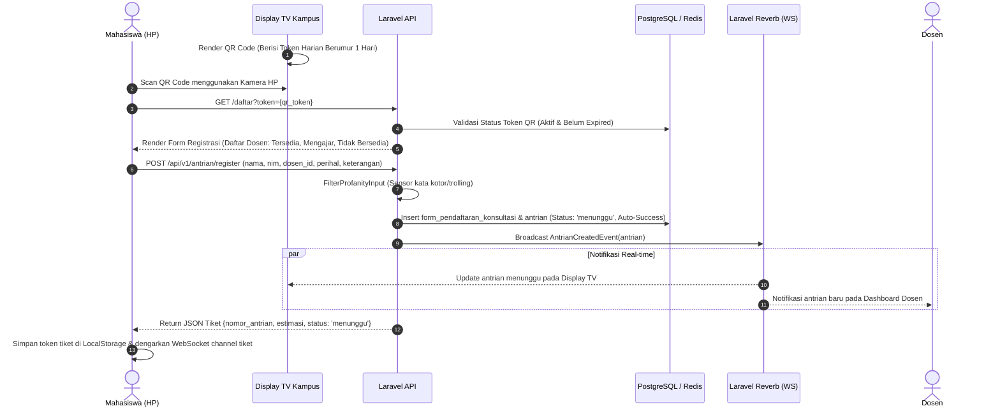
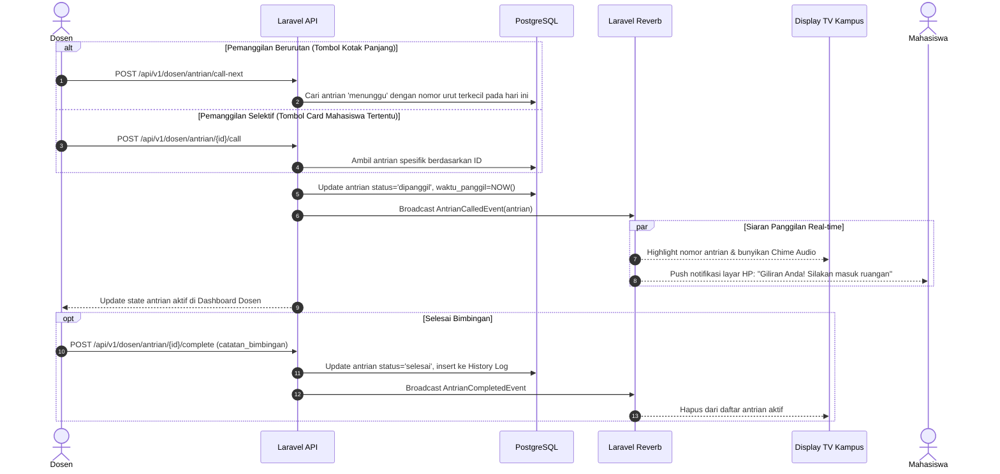
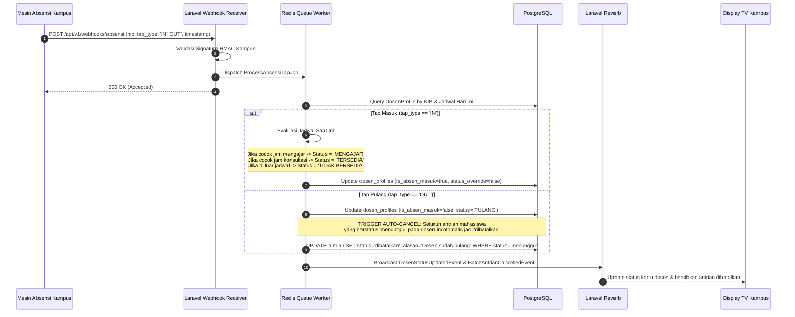

# 05 — Arsitektur Sistem
## Sinkansen: Sistem Informasi Ketersediaan Dosen & Antrian Konsultasi Kampus

> **Dokumen**: C4 Model · Sequence Diagram · API Contract · WebSocket Spec · Security & RBAC · ADR · Deployment  
> **Versi**: 1.0 · **Status**: Approved for Implementation · **Tanggal**: September 2026  
> **Repositori**: [github.com/Cahyadi-Prasetyo/sinkansen](https://github.com/Cahyadi-Prasetyo/sinkansen)

---

## 1. Ringkasan Arsitektur

**Sinkansen** dibangun menggunakan arsitektur **Fullstack Monolith Modern** berbasis **Laravel 12** sebagai backend core & API engine, dan **React 19 + Vite + Tailwind CSS v4** sebagai Single Page Application (SPA) client yang terpasang langsung di dalam direktori `resources/js/`.

Komunikasi real-time status kehadiran dosen dan antrian pemanggilan mahasiswa dikelola melalui **Laravel Reverb (WebSocket)** dengan event-driven broadcasting berkecepatan tinggi, didukung oleh database relasional (PostgreSQL / MySQL) sebagai *single source of truth* dan **Redis** untuk antrian job latar belakang (Queue worker) serta caching.

### 1.1. Parameter Kunci Sistem & Dampak Desain

| Parameter | Nilai Target | Implikasi Desain Arsitektur |
|---|---|---|
| **Latensi Broadcast Status** | p95 < 500 ms | Menggunakan WebSocket murni via Laravel Reverb; menghindari client-polling terus-menerus. |
| **Model Akses Mahasiswa** | Tanpa Registrasi / Akun | Menggunakan *Ephemeral Daily Session* berbasis token QR Code dinamis harian yang di-scan langsung dari Display TV kampus. |
| **Kapasitas Display TV** | 10–50 Monitor Kampus | Read-heavy, koneksi WebSocket persistent per monitor dengan payload ringkas (hanya delta status atau ID antrian). |
| **Integrasi Absensi** | Webhook / Polling API Kampus | Worker background queue terisolasi (`AbsensiSyncJob`) agar lonjakan data tap dosen tidak menghambat traffic user. |
| **Kapasitas Antrian Harian** | Rata-rata 200–500 tiket/fakultas | Soft reset harian, auto-cancel jika dosen `PULANG`, dan pembersihan data transient secara otomatis via schedule cron. |
| **Infrastruktur Target** | 1 Node Server VPS / On-Premise Kampus (2 vCPU / 4 GB RAM) | Efisien, hemat resource, dapat dijalankan dengan Docker Compose tanpa overhead microservices. |

---

## 2. C4 Model

### 2.1. Level 1 — System Context Diagram

Diagram ini mengilustrasikan batasan sistem Sinkansen beserta interaksinya dengan pengguna (eksternal & internal) dan sistem eksternal kampus.

```
                  +----------------------------------------------+
                  |               Mahasiswa (Guest)              |
                  |     (Smartphone / Browser - Tanpa Login)     |
                  +----------------------------------------------+
                       |                                  |
            [1. Scan QR Monitor]               [4. Pantau Status &]
            [   Daftar Antrian ]               [   Tiket Pribadi  ]
                       v                                  v
+-----------------------------+               +----------------------------------+
|   Display TV Kampus / Kiosk |               |                                  |
|   (Monitor Lorong Jurusan)  |               |            SINKANSEN             |
+-----------------------------+               |          SYSTEM SUITE            |
                       ^                      |                                  |
            [Broadcast Antrian &]             | - Web Portal Publik              |
            [   Status Dosen    ]             | - Pendaftaran Antrian Real-time  |
                       +----------------------| - Dashboard Dosen & Pemanggilan  |
                                              | - Panel Operator & Admin         |
+-----------------------------+               | - Modul Autentikasi & RBAC       |
|    Dosen, Operator, Admin   |-------------->|                                  |
|         Superadmin          |  [Login &]    +----------------------------------+
|      (Desktop / Tablet)     |  [Kelola ]                     ^
+-----------------------------+                                |
                                                   [Webhook / REST API]
                                                   [  Sync Data Tap   ]
                                                               |
                                              +----------------------------------+
                                              |    Sistem Absensi Tap Kampus     |
                                              |    (RFID / Fingerprint Server)   |
                                              +----------------------------------+
```

---

### 2.2. Level 2 — Container Diagram

Diagram kontainer memetakan komponen aplikasi, runtime environment, datastore, dan protokol komunikasi.

```
+---------------------------------------------------------------------------------------------------+
|                                      SERVER ENVIRONMENT (DOCKER)                                   |
|                                                                                                   |
|  +---------------------------------------------------------------------------------------------+  |
|  |                                  Reverse Proxy (Nginx / Caddy)                              |  |
|  |                                Ports: 80 (HTTP) -> 443 (HTTPS)                              |  |
|  |                                                                                             |  |
|  |     /api/*, /admin/*, /dosen/* ------> [PHP-FPM :9000]                                      |  |
|  |     /app/*, /reverb/*           ------> [Laravel Reverb WebSocket :8080]                     |  |
|  |     /build/*, /assets/*         ------> [Static Storage / Vite Bundle]                       |  |
|  +---------------------------------------------------------------------------------------------+  |
|                                         |                                  |                      |
|                                         v                                  v                      |
|  +-----------------------------------------------+  +------------------------------------------+  |
|  |          Laravel 12 Application Core          |  |         Laravel Reverb Server            |  |
|  |                   (PHP 8.2+)                  |  |          (WebSocket Engine)              |  |
|  |                                               |  |                                          |  |
|  | - Routing & Controller HTTP                   |  | - Channel: public-display               |  |
|  | - Middleware RBAC & Daily QR Session Guard    |  | - Channel: private-dosen.{id}           |  |
|  | - Eloquent ORM (17 Entities)                  |  | - Channel: private-queue.{id}           |  |
|  | - Queue Worker (Absensi Sync & Broadcaster)   |  +------------------------------------------+  |
|  +-----------------------------------------------+                         ^                      |
|             |                                   |                          |                      |
|             v                                   v                          | Redis Pub/Sub        |
|  +--------------------+               +--------------------+               |                      |
|  |    PostgreSQL 16   |               |      Redis 7       |---------------+                      |
|  |      / MySQL 8     |               |                    |                                      |
|  |                    |               | - Cache & Session  |                                      |
|  | Single Source of   |               | - Queue Driver     |                                      |
|  | Truth (17 Tabel)   |               | - Rate Limiter     |                                      |
|  +--------------------+               +--------------------+                                      |
+---------------------------------------------------------------------------------------------------+
                                          |
                                          | JSON REST / Inertia / React Bundle
                                          v
+---------------------------------------------------------------------------------------------------+
|                                       CLIENT APPLICATION LAYER                                    |
|                                                                                                   |
|  +--------------------------------+  +--------------------------------+  +---------------------+  |
|  |    Display TV Screen (Kiosk)   |  |   Mahasiswa Mobile Web (PWA)   |  |  Dosen & Admin Hub  |  |
|  |  - Fullscreen Live Dashboard   |  |  - Form Pendaftaran Instan     |  |  - Dashboard Dosen  |  |
|  |  - Dynamic QR Generator Code   |  |  - Live Status Tiket Saya      |  |  - Quick Caller Pad |  |
|  |  - Daftar Dosen & Lokasi Aktif |  |  - Auto Alert Panggilan        |  |  - Manajemen Akun   |  |
|  +--------------------------------+  +--------------------------------+  +---------------------+  |
+---------------------------------------------------------------------------------------------------+
```

---

### 2.3. Level 3 — Component Diagram

#### A. Backend Architecture (Laravel 12 Core)

```
app/
├── Http/
│   ├── Controllers/
│   │   ├── Auth/
│   │   │   └── AuthenticatedSessionController.php  # Login & session Dosen/Admin/Operator
│   │   ├── Api/
│   │   │   ├── PublicController.php               # Data dosen live & landing public
│   │   │   ├── AntrianRegistrationController.php  # Form submit mahasiswa (auto-success)
│   │   │   ├── DosenDashboardController.php       # Call next, selective call, update status
│   │   │   ├── OperatorQrController.php           # Generate daily QR & content moderation
│   │   │   ├── AdminUserController.php            # Manajemen akun dosen/operator terbatas
│   │   │   └── AbsensiWebhookController.php       # Ingestion tap masuk/pulang dosen
│   │   └── Profile/
│   │       └── DosenProfileController.php         # Edit foto, prodi, lokasi, jadwal
│   ├── Middleware/
│   │   ├── VerifyDailyQrToken.php                 # Proteksi akses form pendaftaran antrian
│   │   ├── RoleHierarchyMiddleware.php            # Otorisasi role superadmin/admin/operator/dosen
│   │   └── FilterProfanityInput.php               # Filter kata tidak pantas otomatis
│   └── Requests/
│       ├── StoreAntrianRequest.php                # Validasi NIM, Nama, Dosen, Perihal
│       └── UpdateDosenStatusRequest.php           # Validasi status & dropdown lokasi
│
├── Models/
│   ├── User.php, SuperadminProfile.php, AdminProfile.php, OperatorProfile.php
│   ├── DosenProfile.php, Gedung.php, Ruangan.php, Fakultas.php, ProgramStudi.php
│   ├── JadwalMengajar.php, JadwalKonsultasi.php, QrCode.php
│   ├── FormPendaftaranKonsultasi.php, Antrian.php, AbsensiSyncLog.php, ActivityLog.php
│
├── Events/
│   ├── AntrianCreatedEvent.php                    # Broadcast antrian baru ke Dosen
│   ├── AntrianCalledEvent.php                     # Broadcast panggilan ke Display TV & Mahasiswa
│   ├── DosenStatusUpdatedEvent.php                # Broadcast perubahan status/lokasi dosen
│   └── DosenPulangEvent.php                       # Trigger auto-cancel antrian menunggu
│
├── Listeners/
│   ├── BroadcastToDisplayListener.php
│   └── AutoCancelPendingAntrianListener.php
│
└── Jobs/
    ├── ProcessAbsensiTapJob.php                   # Pemrosesan event absensi dosen
    └── DailyQueueResetJob.php                     # Reset status harian pada tengah malam
```

#### B. Frontend Architecture (React 19 + Tailwind v4)

```
resources/js/
├── app.jsx                                        # Entry point, mounts React root
├── MainApp.jsx                                    # Router & Layout Orchestrator
├── components/
│   ├── ui/                                        # Atomic design (Button, Card, Badge, Modal, Input)
│   ├── display/
│   │   ├── DisplayTvHeader.jsx                    # Jam digital, info fakultas, status koneksi
│   │   ├── LiveDosenGrid.jsx                      # Grid dosen (Foto, Nama, Lokasi, Status chip)
│   │   ├── DynamicQrBox.jsx                       # Render QR Code harian untuk scan mahasiswa
│   │   └── CurrentCallingBanner.jsx               # Banner highlight nomor yang sedang dipanggil
│   ├── mahasiswa/
│   │   ├── ConsultationForm.jsx                   # Form input nama, nim, perihal, keterangan
│   │   ├── TicketPassCard.jsx                     # Tampilan tiket digital antrian (live update)
│   │   └── AudioNotification.jsx                  # Bell chime saat nomor antrian dipanggil
│   ├── dosen/
│   │   ├── QuickCallerPanel.jsx                   # Tombol kotak panjang (Sequential Next Call)
│   │   ├── SelectiveQueueCard.jsx                 # Card antrian per mahasiswa (Selective Call)
│   │   ├── StatusLocationToggle.jsx               # Selector status & dropdown Gedung/Ruangan
│   │   ├── ScheduleSlotManager.jsx                # Multi-slot input jadwal mengajar & bimbingan
│   │   └── HistoryConsultationLog.jsx             # Riwayat antrian selesai / batal
│   └── operator/
│       ├── QrGeneratorModal.jsx                   # Tombol terbit QR hari ini & preview
│       └── ContentModerationTable.jsx             # Filter sensor kata & hapus trolling
├── hooks/
│   ├── useEcho.js                                 # Hook koneksi WebSocket Laravel Reverb
│   ├── useLiveQueue.js                            # State antrian dosen real-time
│   └── useDosenStatus.js                          # State status ketersediaan live
└── services/
    ├── api.js                                     # Axios instance dengan interceptor
    └── soundEffect.js                             # Web Audio chime generator
```

---

## 3. Diagram Alur & Sequence Diagram

### 3.1. Alur Registrasi Antrian Mahasiswa via Scan QR

Mahasiswa **hanya** dapat mendaftar antrian setelah memindai QR Code fisik di Display TV kampus.



---

### 3.2. Alur Pemanggilan Antrian oleh Dosen (Sequential & Selective)

Dosen memiliki fleksibilitas untuk memanggil nomor antrian berikutnya secara berurutan atau memanggil antrian tertentu secara selektif.



---

### 3.3. Alur Sinkronisasi Otomatis Kehadiran Dosen via API Absensi Kampus

Sistem Sinkansen bertindak sebagai *consumer* event tap RFID/Biometrik kampus untuk memastikan status dosen selalu akurat tanpa beban manual.



---

## 4. Spesifikasi Kontrak API (API Contract)

Semua endpoint API internal menggunakan prefix `/api/v1/` dengan respon standar JSON.

### 4.1. Format Standar Respon API

```json
{
  "success": true,
  "message": "Operasi berhasil dilakukan.",
  "data": {},
  "meta": {
    "timestamp": "2026-09-19T14:30:00Z",
    "version": "1.0.0"
  }
}
```

Format respon error:
```json
{
  "success": false,
  "message": "Validasi gagal.",
  "errors": {
    "nim": ["NIM wajib diisi dan harus berupa angka."]
  }
}
```

### 4.2. Katalog Endpoint Utama

| Endpoint | Method | Role Akses | Fungsi & Deskripsi |
|---|---|---|---|
| `/api/v1/public/dosen-list` | `GET` | Publik | Mengambil daftar dosen, status live, lokasi, dan daftar mahasiswa aktif yang sedang bimbingan (tanpa QR). |
| `/api/v1/antrian/verify-qr` | `POST` | Publik | Validasi token QR fisik dari kamera scan mahasiswa. |
| `/api/v1/antrian/register` | `POST` | Publik (Valid QR) | Submit formulir antrian (Nama, NIM, Dosen, Perihal, Keterangan). Status auto-success. |
| `/api/v1/antrian/{id}/status` | `GET` | Publik (Mahasiswa) | Cek status tiket antrian mahasiswa secara berkala/fallback jika WS disconnect. |
| `/api/v1/dosen/status-location` | `PATCH` | Dosen | Mengubah status (`TERSEDIA`, `MENGAJAR`, dll.) dan dropdown lokasi (`gedung_id`, `ruangan_id`, `lokasi_lainnya`). |
| `/api/v1/dosen/schedules` | `PUT` | Dosen | Mengatur multi-slot jam mengajar dan jam konsultasi per hari. |
| `/api/v1/dosen/antrian/call-next`| `POST` | Dosen | Memanggil mahasiswa urutan pertama (Sequential Call). |
| `/api/v1/dosen/antrian/{id}/call`| `POST` | Dosen | Memanggil mahasiswa tertentu dari card list (Selective Call). |
| `/api/v1/dosen/antrian/{id}/action`| `PATCH` | Dosen | Mengubah status antrian menjadi `selesai` atau `dibatalkan`. |
| `/api/v1/operator/qr/generate` | `POST` | Operator / Superadmin | Menerbitkan token QR Code harian baru untuk Display TV. |
| `/api/v1/operator/moderation/filter`| `POST` | Operator | Melakukan sensor/filter kata tidak pantas pada pendaftaran antrian. |
| `/api/v1/admin/users/{id}/password` | `PATCH` | Admin Fakultas | Reset password akun dosen/operator di fakultasnya. |
| `/api/v1/admin/users/{id}/toggle-active`| `PATCH`| Admin Fakultas | Mengaktifkan/menonaktifkan akun (`is_active = false`). |
| `/api/v1/superadmin/profiles` | `POST` | Superadmin | Membuat profil pengguna sebelum membuat kredensial akun login. |
| `/api/v1/webhooks/absensi` | `POST` | Mesin Absensi | Menerima payload tap masuk / tap pulang dosen dari kampus. |

---

## 5. Spesifikasi Komunikasi Real-time (WebSocket)

Koneksi real-time diimplementasikan menggunakan **Laravel Reverb** (kompatibel dengan Pusher Protocol).

### 5.1. Channel Matrix & Hak Akses

| Nama Channel | Tipe Channel | Otorisasi | Konsumen | Deskripsi Event |
|---|---|---|---|---|
| `display-tv.{fakultas_id}` | Public | Siapa saja | Display TV Monitor, Web Publik | `dosen.status.updated`, `antrian.called`, `antrian.cleared` |
| `dosen.{dosen_id}` | Private | Dosen Terautentikasi | Dashboard Dosen | `antrian.new.registered`, `antrian.cancelled` |
| `ticket.{antrian_id}` | Public | Menggunakan Token Tiket | HP Mahasiswa | `ticket.status.changed`, `ticket.called` |
| `operator.{fakultas_id}` | Private | Operator / Admin | Dashboard Operator | `qr.regenerated`, `moderation.flagged` |

### 5.2. Payload Event WebSocket

#### A. Event: `antrian.called` (Disiarkan ke `display-tv.{fakultas_id}` & `ticket.{antrian_id}`)
```json
{
  "event": "antrian.called",
  "data": {
    "antrian_id": "b1a2c3d4-0000-4000-8000-000000000001",
    "nomor_antrian": "A-007",
    "mahasiswa_nama": "M***a (Nama Sensor/Alias)",
    "dosen_nama": "Dr. Ir. Bambang Hermanto, M.T.",
    "lokasi": {
      "gedung": "Gedung Teori A",
      "ruangan": "R. 302",
      "lokasi_lainnya": null
    },
    "waktu_panggil": "2026-09-19T14:35:12Z",
    "audio_chime": true
  }
}
```

#### B. Event: `dosen.status.updated`
```json
{
  "event": "dosen.status.updated",
  "data": {
    "dosen_id": "d1a2c3d4-0000-4000-8000-000000000002",
    "nama_lengkap": "Dr. Ir. Bambang Hermanto, M.T.",
    "status": "MENGAJAR",
    "is_absen_masuk": true,
    "lokasi": {
      "gedung": "Gedung Teori B",
      "ruangan": "Lab Jaringan",
      "lokasi_lainnya": null
    },
    "jumlah_antrian_menunggu": 4
  }
}
```

---

## 6. Arsitektur Keamanan & Otorisasi (RBAC)

### 6.1. Matriks Otorisasi Berdasarkan Role

Sistem menerapkan prinsip *Least Privilege* dengan batasan operasional yang sangat tegas:

| Kemampuan / Hak Akses | Mahasiswa (Guest) | Dosen | Operator Kampus | Admin Fakultas | Superadmin |
|---|:---:|:---:|:---:|:---:|:---:|
| Lihat Status Dosen & Mahasiswa Bimbingan | ✅ | ✅ | ✅ | ✅ | ✅ |
| Scan QR & Registrasi Antrian Mandiri | ✅ (Di Kiosk) | ❌ | ❌ | ❌ | ❌ |
| Edit Profil (Foto, Nama, Prodi, Email Sendiri) | ❌ | ✅ | ❌ | ❌ | ✅ |
| Update Status Ketersediaan & Lokasi | ❌ | ✅ | ❌ | ❌ | ✅ (Override) |
| Input Multi-Slot Jadwal Mengajar/Konsultasi | ❌ | ✅ | ❌ | ❌ | ✅ |
| Panggil Antrian (Sequential & Selektif) | ❌ | ✅ | ❌ | ❌ | ❌ |
| Generate QR Code Harian Display TV | ❌ | ❌ | ✅ | ❌ | ✅ |
| Sensor Kata Tidak Pantas / Moderasi Form | ❌ | ❌ | ✅ | ❌ | ✅ |
| Buat Akun Dosen & Operator Baru | ❌ | ❌ | ❌ | ✅ (Fakultasnya) | ✅ (Global) |
| Reset Password Akun Terbatas | ❌ | ❌ | ❌ | ✅ (Fakultasnya) | ✅ |
| Menonaktifkan Akun (`is_active = false`) | ❌ | ❌ | ❌ | ✅ (Fakultasnya) | ✅ |
| Buat Profil Sebelum Kredensial Akun | ❌ | ❌ | ❌ | ❌ | ✅ |
| Konfigurasi Master Data (Fakultas/Gedung) | ❌ | ❌ | ❌ | ❌ | ✅ |

### 6.2. Mekanisme Keamanan Khusus

1. **Daily Ephemeral QR Token**:
   - Token QR di-generate menggunakan `SHA-256(secret_salt + tanggal_hari_ini + random_nonce)`.
   - Token hanya aktif untuk 1 hari kalender dan divalidasi oleh middleware `VerifyDailyQrToken`. Mahasiswa tidak bisa mendaftar dari rumah tanpa memindai monitor fisik di kampus.
2. **Filter Kata Tidak Pantas (Profanity & Hate Speech Sanitizer)**:
   - Formulir registrasi mahasiswa melalui pipeline sanitasi teks otomatis untuk mendeteksi kata kasar, SARA, atau spam.
   - Operator memiliki modul manual untuk me-review dan melakukan sensor bintang (`***`) atau menghapus antrian yang melanggar norma kampus.
3. **Rate Limiting Ketat**:
   - Pendaftaran antrian dibatasi maksimal **1 antrian aktif per NIM per hari** untuk mencegah *queue hoarding*.
   - Endpoint pendaftaran dibatasi 10 request per menit per IP address.

---

## 7. Architecture Decision Records (ADR)

### ADR-01: Pemilihan Fullstack Monolith (Laravel 12 + React 19 + Vite)
- **Konteks**: Diperlukan pengembangan yang cepat dengan integrasi UI modern untuk Display TV dan mobile phone.
- **Keputusan**: Menggunakan Laravel 12 di root direktori dengan frontend React di `resources/js/` (Opsi 2).
- **Konsekuensi**: Deployment menjadi sangat sederhana (cukup 1 codebase), routing asset dikendalikan penuh oleh Vite plugin resmi Laravel, eliminasi isu Cross-Origin (CORS) saat produksi.

### ADR-02: Penggunaan Laravel Reverb untuk WebSocket Engine
- **Konteks**: Sistem membutuhkan siaran pemanggilan antrian real-time dengan latensi sub-detik ke layar TV lorong kampus.
- **Keputusan**: Menggunakan **Laravel Reverb** bawaan resmi Laravel 11/12 daripada bergantung pada layanan berbayar pihak ketiga (seperti Pusher Cloud) atau memelihara runtime terpisah (seperti Socket.io/Node.js).
- **Konsekuensi**: Full kontrol di server lokal kampus, tidak ada biaya langganan bulanan, native support dengan Laravel Event Broadcasting.

### ADR-03: Pemisahan Entitas Profil dari Akun Autentikasi (Users)
- **Konteks**: Kebutuhan bisnis mengharuskan Superadmin mendaftarkan profil fisik tenaga pengajar/pegawai terlebih dahulu sebelum kredensial akun login diterbitkan.
- **Keputusan**: Tabel `superadmin_profiles`, `admin_profiles`, `operator_profiles`, dan `dosen_profiles` dibuat independen dengan foreign key `user_id` yang bersifat `NULLABLE`.
- **Konsekuensi**: Profil institusi dapat diisi lengkap terlebih dahulu; pembuatan akun login dilakukan pada langkah kedua dengan menghubungkan `user_id` secara 1:1.

### ADR-04: Kebijakan Auto-Cancel Antrian saat Dosen Pulang
- **Konteks**: Mahasiswa seringkali menggantung di daftar antrian padahal dosen telah meninggalkan area kampus.
- **Keputusan**: Ketika status dosen berubah menjadi `PULANG` (baik via tap absensi keluar ataupun override manual dosen), sistem otomatis membatalkan antrian berstatus `menunggu`.
- **Konsekuensi**: Mengurangi kebingungan mahasiswa; status antrian di Display TV langsung bersih dan mencerminkan realitas fisik.

---

## 8. Spesifikasi Deployment & Infrastruktur

### 8.1. Docker Compose Production Topology

Sistem dirancang untuk dapat di-deploy dengan mudah menggunakan **Docker Compose** di server kampus:

```yaml
services:
  app:
    build:
      context: .
      dockerfile: Dockerfile
    container_name: sinkansen_app
    restart: unless-stopped
    environment:
      APP_ENV: production
      APP_KEY: ${APP_KEY}
      DB_CONNECTION: pgsql
      DB_HOST: postgres
      DB_PORT: 5432
      DB_DATABASE: sinkansen_db
      DB_USERNAME: sinkansen_user
      DB_PASSWORD: ${DB_PASSWORD}
      REDIS_HOST: redis
      BROADCAST_CONNECTION: reverb
    volumes:
      - ./:/var/www/html
    depends_on:
      - postgres
      - redis

  reverb:
    build:
      context: .
      dockerfile: Dockerfile
    container_name: sinkansen_reverb
    command: php artisan reverb:start --host=0.0.0.0 --port=8080
    restart: unless-stopped
    ports:
      - "8080:8080"
    depends_on:
      - app

  queue_worker:
    build:
      context: .
      dockerfile: Dockerfile
    container_name: sinkansen_queue
    command: php artisan queue:work redis --sleep=3 --tries=3
    restart: unless-stopped
    depends_on:
      - app
      - redis

  webserver:
    image: nginx:alpine
    container_name: sinkansen_webserver
    restart: unless-stopped
    ports:
      - "80:80"
      - "443:443"
    volumes:
      - ./:/var/www/html
      - ./docker/nginx/default.conf:/etc/nginx/conf.d/default.conf
    depends_on:
      - app
      - reverb

  postgres:
    image: postgres:16-alpine
    container_name: sinkansen_postgres
    restart: unless-stopped
    environment:
      POSTGRES_DB: sinkansen_db
      POSTGRES_USER: sinkansen_user
      POSTGRES_PASSWORD: ${DB_PASSWORD}
    volumes:
      - pgdata:/var/lib/postgresql/data

  redis:
    image: redis:7-alpine
    container_name: sinkansen_redis
    restart: unless-stopped
    volumes:
      - redisdata:/data

volumes:
  pgdata:
  redisdata:
```

### 8.2. Alokasi Resource Minimum Server

- **CPU**: 2 Core vCPU (x86_64 atau ARM64)
- **RAM**: 4 GB (2 GB Base OS + 1 GB PHP-FPM & Reverb + 1 GB PostgreSQL & Redis)
- **Storage**: 40 GB SSD (NVMe direkomendasikan untuk I/O log audit)
- **Bandwidth**: 100 Mbps Local Campus Network
