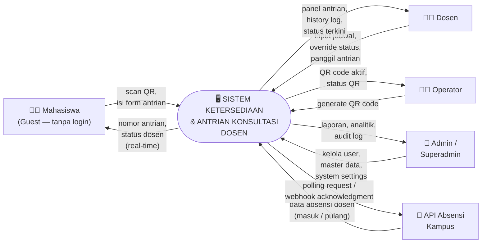
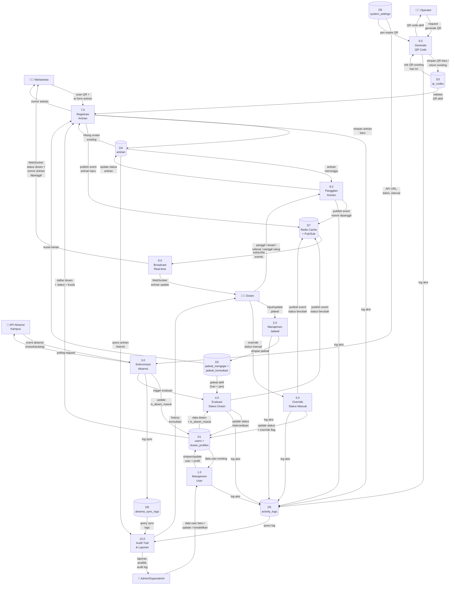

# DFD — Sistem Ketersediaan & Antrian Konsultasi Dosen

> Dokumen ini berisi Data Flow Diagram (DFD) Level 0 (Context Diagram)
> dan Level 1 untuk sistem antrian konsultasi dosen.

---

## DFD Level 0 — Context Diagram

Menunjukkan batasan sistem dan interaksi dengan **5 entitas eksternal**.



### Entitas Eksternal

| # | Entitas | Deskripsi | Autentikasi |
|---|---|---|---|
| 1 | **Mahasiswa (Guest)** | Pengguna akhir yang mendaftar antrian konsultasi | Tanpa login — akses via QR |
| 2 | **Dosen** | Pengajar yang mengelola status & antrian konsultasinya | Login (email + password) |
| 3 | **Operator** | Staf yang mengelola QR code harian | Login (email + password) |
| 4 | **Admin / Superadmin** | Pengelola sistem dan master data | Login (email + password) |
| 5 | **API Absensi Kampus** | Sistem eksternal kampus yang menyediakan data absensi dosen | API token |

---

## DFD Level 1

Dekomposisi sistem menjadi **10 proses utama** dengan data store dan aliran data yang jelas.



---

## Detail Proses Level 1

### Proses 1.0 — Manajemen User

| Aspek | Detail |
|---|---|
| **Input** | Data user baru (nama, email, password, role, fakultas, prodi). Untuk dosen: NIP, kode_antrian, foto |
| **Output** | User tersimpan. Untuk dosen: profil dosen tersimpan |
| **Data Store** | `D1: users + dosen_profiles` (read/write), `D5: activity_logs` (write) |
| **Logic** | Validasi scope admin (hanya fakultas sendiri). Superadmin bisa semua fakultas. Generate password hash. Simpan activity log |

---

### Proses 2.0 — Manajemen Jadwal

| Aspek | Detail |
|---|---|
| **Input** | Data jadwal dari dosen (hari, jam mulai, jam selesai, mata kuliah/kuota) |
| **Output** | Jadwal tersimpan |
| **Data Store** | `D2: jadwal_mengajar + jadwal_konsultasi` (read/write), `D5: activity_logs` (write) |
| **Logic** | Validasi tidak overlap. Validasi `jam_selesai > jam_mulai`. Validasi `kuota_harian > 0` jika diisi |

---

### Proses 3.0 — Sinkronisasi Absensi

| Aspek | Detail |
|---|---|
| **Input** | Event absensi dari API kampus (masuk/pulang), konfigurasi API dari `system_settings` |
| **Output** | Flag `is_absen_masuk` updated, trigger evaluasi status |
| **Data Store** | `D1: dosen_profiles` (write), `D6: system_settings` (read), `D8: absensi_sync_logs` (write) |
| **Logic** | Dua mode: polling (tiap N menit) dan webhook (event-driven). Mapping NIP dosen dari API ke dosen_profiles. Log setiap sync (success/failed/ignored) |

**Aliran detail:**
```
API kampus → raw payload
  → Parse & identifikasi dosen (by NIP)
    → Dosen ditemukan?
      → Ya: update is_absen_masuk → trigger P4.0 (Evaluasi Status)
      → Tidak: log sebagai 'ignored' atau 'failed'
```

---

### Proses 4.0 — Evaluasi Status Dosen

| Aspek | Detail |
|---|---|
| **Input** | Trigger dari P3.0 (sinkronisasi absensi) atau scheduler periodik |
| **Output** | Status ketersediaan dosen updated, WebSocket event broadcast |
| **Data Store** | `D1: dosen_profiles` (read/write), `D2: jadwal` (read), `D7: Redis` (publish), `D5: activity_logs` (write) |
| **Logic** | Evaluasi status berdasarkan kombinasi `is_absen_masuk` + jadwal aktif saat ini. Clear `status_override` saat dipicu oleh pergantian slot jadwal atau event absensi baru |

**Logika evaluasi:**
```
IF is_absen_masuk = false → Status = PULANG
IF is_absen_masuk = true:
  IF ada jadwal_mengajar aktif → Status = MENGAJAR
  ELSE IF ada jadwal_konsultasi aktif → Status = TERSEDIA
  ELSE → Status = TIDAK BERSEDIA
```

---

### Proses 5.0 — Override Status Manual

| Aspek | Detail |
|---|---|
| **Input** | Input manual dari dosen (status baru) |
| **Output** | Status updated, WebSocket event broadcast |
| **Data Store** | `D1: dosen_profiles` (write), `D7: Redis` (publish), `D5: activity_logs` (write) |
| **Logic** | Set `status_ketersediaan` = input dosen. Set `status_override = true`. Tidak mengubah `is_absen_masuk`. Override berlaku sampai trigger berikutnya (scheduler tick atau event absensi) |

---

### Proses 6.0 — Generate QR Code

| Aspek | Detail |
|---|---|
| **Input** | Request dari operator |
| **Output** | QR code (baru atau existing) |
| **Data Store** | `D3: qr_codes` (read/write), `D5: activity_logs` (write), `D6: system_settings` (read) |
| **Logic** | Cek apakah QR aktif hari ini sudah ada → jika ya, return existing. Jika belum, generate `kode_unik` random, set `expired_at` dari `system_settings.qr_expire_hour` |

---

### Proses 7.0 — Registrasi Antrian

| Aspek | Detail |
|---|---|
| **Input** | Scan QR + form (nama, NIM, dosen tujuan, keperluan) |
| **Output** | Nomor antrian |
| **Data Store** | `D3: qr_codes` (read), `D1: dosen_profiles` (read), `D2: jadwal_konsultasi` (read), `D4: antrian` (read/write), `D5: activity_logs` (write), `D7: Redis` (publish) |
| **Logic** | Validasi QR aktif. Filter dosen ≠ Pulang. Cek kuota. Generate nomor atomik. Broadcast antrian baru via WS |

---

### Proses 8.0 — Panggilan Antrian

| Aspek | Detail |
|---|---|
| **Input** | Aksi dosen: panggil selanjutnya, panggil ulang, lewati, selesai |
| **Output** | Status antrian updated, nomor dipanggil di Display TV |
| **Data Store** | `D4: antrian` (read/write), `D7: Redis` (publish), `D5: activity_logs` (write) |
| **Logic** | Panggil: ambil `menunggu` urutan terkecil → `dipanggil`. Lewati: `dipanggil` → `tidak_hadir`. Selesai: `dipanggil` → `selesai`. Panggil ulang: `tidak_hadir` → `dipanggil` (configurable) |

---

### Proses 9.0 — Broadcast Real-time

| Aspek | Detail |
|---|---|
| **Input** | Events dari Redis pub/sub |
| **Output** | WebSocket messages ke semua client yang subscribe |
| **Data Store** | `D7: Redis Cache + Pub/Sub` (subscribe) |
| **Logic** | Subscribe ke channel Redis. Kirim event ke WebSocket clients berdasarkan tipe event (status dosen, nomor antrian dipanggil, antrian baru) |

**WebSocket Channels:**
| Channel | Subscribers | Event |
|---|---|---|
| `dosen:status` | Landing page, Display TV, Panel dosen | Status dosen berubah |
| `antrian:called` | Display TV | Nomor antrian dipanggil |
| `antrian:new` | Panel dosen | Antrian baru masuk |
| `antrian:update` | Panel dosen | Status antrian berubah |

---

### Proses 10.0 — Audit Trail & Laporan

| Aspek | Detail |
|---|---|
| **Input** | Query dari admin/superadmin (filter: tanggal, user, aksi) |
| **Output** | Laporan, analitik, audit log |
| **Data Store** | `D5: activity_logs` (read), `D4: antrian` (read), `D8: absensi_sync_logs` (read) |
| **Logic** | Superadmin: lihat semua log. Admin: hanya log di scope fakultas. Dosen: history konsultasi sendiri (filter tanggal, mahasiswa, status) |

---

## Data Store Summary

| # | Data Store | Entitas DB | Diakses oleh Proses |
|---|---|---|---|
| D1 | `users + dosen_profiles` | `users`, `dosen_profiles` | P1.0, P3.0, P4.0, P5.0, P7.0 |
| D2 | `jadwal_mengajar + jadwal_konsultasi` | `jadwal_mengajar`, `jadwal_konsultasi` | P2.0, P4.0, P7.0 |
| D3 | `qr_codes` | `qr_codes` | P6.0, P7.0 |
| D4 | `antrian` | `antrian` | P7.0, P8.0, P10.0 |
| D5 | `activity_logs` | `activity_logs` | P1.0–P8.0 (write), P10.0 (read) |
| D6 | `system_settings` | `system_settings` | P3.0, P6.0 |
| D7 | `Redis Cache + Pub/Sub` | *(in-memory)* | P4.0, P5.0, P7.0, P8.0 (publish), P9.0 (subscribe) |
| D8 | `absensi_sync_logs` | `absensi_sync_logs` | P3.0 (write), P10.0 (read) |
