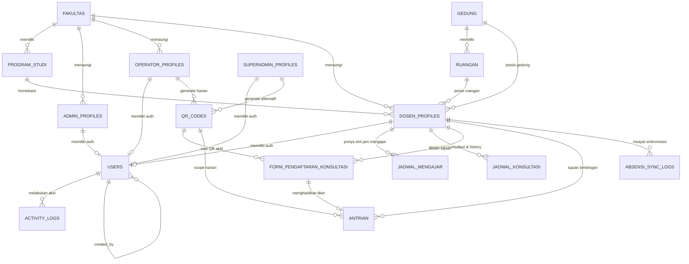

# ERD — Sistem Informasi Ketersediaan Dosen & Antrian Konsultasi (Sinkansen)

> Dokumen ini berisi Entity Relationship Diagram (ERD) lengkap untuk sistem
> Sinkansen versi pembaruan. Semua entitas, atribut, tipe data, constraint,
> dan relasi didokumentasikan secara rinci di sini.

---

## Ringkasan Pembaruan Arsitektur & Rules

1. **Pemisahan Entitas Profil per Role**: Penambahan tabel `superadmin_profiles`, `admin_profiles`, dan `operator_profiles` berdampingan dengan `dosen_profiles`. Profil dibuat terlebih dahulu sebelum akun autentikasi (`users`) dibuat (`user_id` nullable di awal).
2. **Fleksibilitas Edit Profil Dosen**: Dosen dapat memperbarui foto profil (`foto_url`), nama lengkap (`nama_lengkap`), program studi (`prodi_id`), dan email (`users.email`).
3. **Pelacakan Lokasi Dosen di Kampus**: Penambahan relasi master data `gedung` dan `ruangan` (dropdown bertingkat) serta field `lokasi_lainnya` (text field) pada `dosen_profiles`.
4. **Multi-Slot Jadwal Mengajar & Konsultasi**: Dosen dapat menginput lebih dari 1 baris/slot jam mengajar dan konsultasi per hari (cukup jam mulai dan jam selesai).
5. **Auto-Cancel Antrian saat Dosen Pulang**: Jika dosen mengubah statusnya menjadi `pulang`, seluruh antrian mahasiswa yang sedang `menunggu` pada dosen tersebut otomatis berstatus `dibatalkan`.
6. **Form Konsultasi Guest & Ketersediaan**: Form pendaftaran (`nama`, `nim`, `dosen_id`, `perihal`, `keterangan`) bersifat auto-success. Dropdown form tetap memunculkan dosen dengan status `tersedia`, `mengajar`, dan `tidak_bersedia`. Hanya dosen berstatus `pulang` yang tidak dimunculkan.
7. **Relasi QR Code ke Operator & Superadmin**: Tabel `qr_codes` terhubung langsung ke `operator_profiles` dan `superadmin_profiles`.

---

## Daftar Entitas (17 Entitas)

| # | Entitas | Deskripsi | Relasi Utama |
|---|---|---|---|
| 1 | `users` | Kredensial akun autentikasi (email & password_hash) | 1:1 dari profil, Parent dari `activity_logs` |
| 2 | `superadmin_profiles` | Profil Superadmin sistem | 1:1 ke `users`, Parent dari `qr_codes` |
| 3 | `admin_profiles` | Profil Administrator Fakultas | 1:1 ke `users`, Child dari `fakultas` |
| 4 | `operator_profiles` | Profil Operator Harian Display TV | 1:1 ke `users`, Child dari `fakultas`, Parent dari `qr_codes` |
| 5 | `dosen_profiles` | Profil Dosen, Status Ketersediaan & Lokasi | 1:1 ke `users`, Child dari `fakultas`, `program_studi`, `gedung`, `ruangan` |
| 6 | `jadwal_mengajar` | Slot jam mengajar dosen (bisa >1 slot per hari) | Child dari `dosen_profiles` |
| 7 | `jadwal_konsultasi` | Slot jam konsultasi dosen + kuota + history | Child dari `dosen_profiles` |
| 8 | `gedung` | Master data gedung kampus (dropdown lokasi) | Parent dari `ruangan` dan `dosen_profiles` |
| 9 | `ruangan` | Master data ruangan per gedung (dropdown lokasi) | Child dari `gedung`, Parent dari `dosen_profiles` |
| 10 | `qr_codes` | QR code harian untuk registrasi antrian | Child dari `operator_profiles` / `superadmin_profiles`, Parent dari form pendaftaran |
| 11 | `form_pendaftaran_konsultasi` | Data formulir pendaftaran konsultasi mahasiswa | Child dari `qr_codes`, `dosen_profiles`, Parent 1:1 dari `antrian` |
| 12 | `antrian` | Tiket antrian terverifikasi dan urutan panggilan | Child dari `form_pendaftaran_konsultasi`, `qr_codes`, `dosen_profiles` |
| 13 | `fakultas` | Master data fakultas | Parent dari `program_studi`, `admin_profiles`, `operator_profiles`, `dosen_profiles` |
| 14 | `program_studi` | Master data program studi | Child dari `fakultas`, Parent dari `dosen_profiles` |
| 15 | `activity_logs` | Audit trail seluruh aksi operasional sistem | Child dari `users` |
| 16 | `system_settings` | Konfigurasi runtime sistem (key-value) | Child dari `users` (updated_by) |
| 17 | `absensi_sync_logs` | Log histori integrasi API absensi kampus | Child dari `dosen_profiles` |

---

## Diagram ER (Mermaid)



---

## Detail Entitas, Atribut & Constraint

### 1. `users` (Tabel Autentikasi / Kredensial)

| Kolom | Tipe Data | Constraint | Keterangan |
|---|---|---|---|
| `id` | `UUID` | `PRIMARY KEY`, `DEFAULT gen_random_uuid()` | Identifier unik akun |
| `email` | `VARCHAR(150)` | `NOT NULL`, `UNIQUE` | Email login sistem (dapat diedit dosen via profil) |
| `password_hash` | `VARCHAR(255)` | `NOT NULL` | Hash password (bcrypt/argon2) |
| `role` | `ENUM('superadmin','admin','dosen','operator')` | `NOT NULL` | Role pengguna |
| `is_active` | `BOOLEAN` | `NOT NULL`, `DEFAULT true` | Status keaktifan akun |
| `created_by` | `UUID` | `FK → users(id)`, `NULLABLE` | Akun pembuat |
| `created_at` | `TIMESTAMP` | `NOT NULL`, `DEFAULT NOW()` | Waktu pembuatan |
| `updated_at` | `TIMESTAMP` | `NOT NULL`, `DEFAULT NOW()` | Waktu pembaruan |

---

### 2. `superadmin_profiles`

| Kolom | Tipe Data | Constraint | Keterangan |
|---|---|---|---|
| `id` | `UUID` | `PRIMARY KEY`, `DEFAULT gen_random_uuid()` | ID profil superadmin |
| `user_id` | `UUID` | `FK → users(id)`, `UNIQUE`, `NULLABLE` | Di-link setelah akun auth dibuat |
| `nama_lengkap` | `VARCHAR(100)` | `NOT NULL` | Nama lengkap superadmin |
| `no_telepon` | `VARCHAR(20)` | `NULLABLE` | Kontak HP/WhatsApp |
| `foto_url` | `VARCHAR(500)` | `NULLABLE` | URL avatar profil |
| `created_at` | `TIMESTAMP` | `NOT NULL`, `DEFAULT NOW()` | |
| `updated_at` | `TIMESTAMP` | `NOT NULL`, `DEFAULT NOW()` | |

---

### 3. `admin_profiles`

| Kolom | Tipe Data | Constraint | Keterangan |
|---|---|---|---|
| `id` | `UUID` | `PRIMARY KEY`, `DEFAULT gen_random_uuid()` | ID profil admin |
| `user_id` | `UUID` | `FK → users(id)`, `UNIQUE`, `NULLABLE` | Di-link setelah akun auth dibuat |
| `nama_lengkap` | `VARCHAR(100)` | `NOT NULL` | Nama lengkap admin |
| `nip` | `VARCHAR(30)` | `UNIQUE`, `NULLABLE` | NIP / Identitas kepegawaian |
| `fakultas_id` | `UUID` | `FK → fakultas(id)`, `NOT NULL` | Lingkup wewenang fakultas |
| `no_telepon` | `VARCHAR(20)` | `NULLABLE` | Nomor kontak |
| `foto_url` | `VARCHAR(500)` | `NULLABLE` | URL foto profil |
| `created_at` | `TIMESTAMP` | `NOT NULL`, `DEFAULT NOW()` | |
| `updated_at` | `TIMESTAMP` | `NOT NULL`, `DEFAULT NOW()` | |

---

### 4. `operator_profiles`

| Kolom | Tipe Data | Constraint | Keterangan |
|---|---|---|---|
| `id` | `UUID` | `PRIMARY KEY`, `DEFAULT gen_random_uuid()` | ID profil operator |
| `user_id` | `UUID` | `FK → users(id)`, `UNIQUE`, `NULLABLE` | Di-link setelah akun auth dibuat |
| `nama_lengkap` | `VARCHAR(100)` | `NOT NULL` | Nama lengkap operator |
| `nomor_identitas` | `VARCHAR(30)` | `NULLABLE` | NIP / ID Tenaga Kependidikan |
| `fakultas_id` | `UUID` | `FK → fakultas(id)`, `NOT NULL` | Fakultas penugasan operator |
| `no_telepon` | `VARCHAR(20)` | `NULLABLE` | Nomor kontak aktif |
| `created_at` | `TIMESTAMP` | `NOT NULL`, `DEFAULT NOW()` | |
| `updated_at` | `TIMESTAMP` | `NOT NULL`, `DEFAULT NOW()` | |

---

### 5. `dosen_profiles` (Profil & Status Ketersediaan Dosen)

Dosen dapat melakukan edit profil secara mandiri: `foto_url`, `nama_lengkap`, `prodi_id`, dan email (pada akun `users`). Dosen juga dapat mengupdate status ketersediaan dan lokasi keberadaan fisiknya di kampus.

| Kolom | Tipe Data | Constraint | Keterangan |
|---|---|---|---|
| `id` | `UUID` | `PRIMARY KEY`, `DEFAULT gen_random_uuid()` | ID profil dosen |
| `user_id` | `UUID` | `FK → users(id)`, `UNIQUE`, `NULLABLE` | Di-link setelah akun auth dibuat |
| `nama_lengkap` | `VARCHAR(100)` | `NOT NULL` | Nama dan gelar dosen (bisa diedit dosen) |
| `nip` | `VARCHAR(30)` | `NOT NULL`, `UNIQUE` | NIP / NIDN resmi dosen |
| `fakultas_id` | `UUID` | `FK → fakultas(id)`, `NOT NULL` | Asal fakultas |
| `prodi_id` | `UUID` | `FK → program_studi(id)`, `NOT NULL` | Program studi dosen (bisa diedit dosen) |
| `kode_antrian` | `CHAR(3)` | `NOT NULL`, `UNIQUE` | Prefix nomor antrian dosen (misal `A`, `B`) |
| `foto_url` | `VARCHAR(500)` | `NULLABLE` | URL foto profil resmi dosen (bisa diedit dosen) |
| `status_ketersediaan` | `ENUM('tersedia','mengajar','tidak_bersedia','pulang')` | `NOT NULL`, `DEFAULT 'pulang'` | Status live ketersediaan dosen di kampus |
| `status_override` | `BOOLEAN` | `NOT NULL`, `DEFAULT false` | True = status diubah manual oleh dosen |
| `is_absen_masuk` | `BOOLEAN` | `NOT NULL`, `DEFAULT false` | Flag tap hadir dari API absensi kampus |
| `gedung_id` | `UUID` | `FK → gedung(id)`, `NULLABLE` | Pilihan gedung keberadaan dosen (menu dropdown) |
| `ruangan_id` | `UUID` | `FK → ruangan(id)`, `NULLABLE` | Pilihan ruangan keberadaan dosen (menu dropdown) |
| `lokasi_lainnya` | `VARCHAR(255)` | `NULLABLE` | Keterangan lokasi kustom (menu text field) |
| `status_updated_at` | `TIMESTAMP` | `NOT NULL`, `DEFAULT NOW()` | Terakhir status diubah/dievaluasi |
| `created_at` | `TIMESTAMP` | `NOT NULL`, `DEFAULT NOW()` | Waktu pendaftaran profil |
| `updated_at` | `TIMESTAMP` | `NOT NULL`, `DEFAULT NOW()` | Waktu pembaruan profil |

**Business Rules Dosen:**
- **Auto-Cancel Antrian saat Status PULANG**: Jika dosen mengubah statusnya menjadi `pulang` (baik via override manual maupun tap pulang API absensi), **seluruh antrian mahasiswa dengan status `menunggu` pada dosen tersebut otomatis diubah menjadi `dibatalkan`** dan notifikasi disiarkan via WebSocket.
- **Fleksibilitas Form saat Status TIDAK BERSEDIA**: Mahasiswa tetap dapat memilih dan mendaftar antrian pada dosen yang berstatus `tidak_bersedia`. Dosen berstatus `pulang` tidak dimunculkan di form.

---

### 6. `jadwal_mengajar`

Slot jam mengajar mingguan dosen. Dosen dapat menginput lebih dari 1 kolom/baris jam mengajar per hari (cukup jam mulai dan jam selesai).

| Kolom | Tipe Data | Constraint | Keterangan |
|---|---|---|---|
| `id` | `UUID` | `PRIMARY KEY`, `DEFAULT gen_random_uuid()` | ID slot jam mengajar |
| `dosen_id` | `UUID` | `FK → dosen_profiles(id)`, `NOT NULL` | Dosen pemilik jadwal |
| `hari` | `ENUM('senin','selasa','rabu','kamis','jumat','sabtu','minggu')` | `NOT NULL` | Hari mengajar |
| `jam_mulai` | `TIME` | `NOT NULL` | Jam mulai sesi mengajar |
| `jam_selesai` | `TIME` | `NOT NULL` | Jam selesai sesi mengajar |
| `mata_kuliah` | `VARCHAR(100)` | `NULLABLE` | Catatan/nama mata kuliah (opsional) |
| `created_at` | `TIMESTAMP` | `NOT NULL`, `DEFAULT NOW()` | |
| `updated_at` | `TIMESTAMP` | `NOT NULL`, `DEFAULT NOW()` | |

**Constraint:**
- `CHECK (jam_selesai > jam_mulai)`

---

### 7. `jadwal_konsultasi`

Slot jam konsultasi mingguan dosen. Dosen dapat menginput lebih dari 1 baris jadwal konsultasi per hari.

| Kolom | Tipe Data | Constraint | Keterangan |
|---|---|---|---|
| `id` | `UUID` | `PRIMARY KEY`, `DEFAULT gen_random_uuid()` | ID slot jam konsultasi |
| `dosen_id` | `UUID` | `FK → dosen_profiles(id)`, `NOT NULL` | Dosen pemilik jadwal |
| `hari` | `ENUM('senin','selasa','rabu','kamis','jumat','sabtu','minggu')` | `NOT NULL` | Hari konsultasi |
| `jam_mulai` | `TIME` | `NOT NULL` | Jam mulai konsultasi |
| `jam_selesai` | `TIME` | `NOT NULL` | Jam selesai konsultasi |
| `kuota_harian` | `INTEGER` | `NULLABLE` | Kuota antrian maksimal (NULL = tanpa batas) |
| `history_perubahan` | `JSONB` | `NULLABLE` | Log histori modifikasi jadwal & kuota |
| `is_active` | `BOOLEAN` | `NOT NULL`, `DEFAULT true` | Status keaktifan |
| `created_at` | `TIMESTAMP` | `NOT NULL`, `DEFAULT NOW()` | |
| `updated_at` | `TIMESTAMP` | `NOT NULL`, `DEFAULT NOW()` | |

---

### 8. `gedung` (Master Lokasi Kampus)

Master data gedung kampus untuk pilihan dropdown lokasi dosen.

| Kolom | Tipe Data | Constraint | Keterangan |
|---|---|---|---|
| `id` | `UUID` | `PRIMARY KEY`, `DEFAULT gen_random_uuid()` | ID gedung |
| `nama_gedung` | `VARCHAR(100)` | `NOT NULL` | Nama gedung (misal: Gedung A, Gedung Rektorat) |
| `kode_gedung` | `VARCHAR(20)` | `NOT NULL`, `UNIQUE` | Kode singkatan gedung |
| `fakultas_id` | `UUID` | `FK → fakultas(id)`, `NULLABLE` | Asosiasi fakultas jika gedung per-fakultas |

---

### 9. `ruangan` (Master Ruangan Kampus)

Master data ruangan bertingkat berdasarkan gedung untuk pilihan dropdown lokasi dosen.

| Kolom | Tipe Data | Constraint | Keterangan |
|---|---|---|---|
| `id` | `UUID` | `PRIMARY KEY`, `DEFAULT gen_random_uuid()` | ID ruangan |
| `gedung_id` | `UUID` | `FK → gedung(id)`, `NOT NULL` | Gedung tempat ruangan berada |
| `nama_ruangan` | `VARCHAR(100)` | `NOT NULL` | Nama ruangan (misal: Ruang Dosen 201, Lab Komputer) |
| `kode_ruangan` | `VARCHAR(20)` | `NOT NULL` | Kode ruangan |

---

### 10. `qr_codes`

Tabel QR code harian. Terhubung langsung ke `operator_profiles` atau `superadmin_profiles`.

| Kolom | Tipe Data | Constraint | Keterangan |
|---|---|---|---|
| `id` | `UUID` | `PRIMARY KEY`, `DEFAULT gen_random_uuid()` | ID record QR |
| `kode_unik` | `VARCHAR(64)` | `NOT NULL`, `UNIQUE` | Random secure string untuk URL QR |
| `generated_by_role` | `ENUM('operator','superadmin')` | `NOT NULL` | Pihak pembuat QR |
| `operator_id` | `UUID` | `FK → operator_profiles(id)`, `NULLABLE` | Terisi jika dibuat Operator |
| `superadmin_id` | `UUID` | `FK → superadmin_profiles(id)`, `NULLABLE` | Terisi jika dibuat Superadmin |
| `tanggal_berlaku` | `DATE` | `NOT NULL` | Tanggal validitas |
| `expired_at` | `TIMESTAMP` | `NOT NULL` | Jam kedaluwarsa harian |
| `status` | `ENUM('aktif','expired')` | `NOT NULL`, `DEFAULT 'aktif'` | Status validitas QR |
| `created_at` | `TIMESTAMP` | `NOT NULL`, `DEFAULT NOW()` | |

**Constraint:**
- `CHECK ((operator_id IS NOT NULL AND superadmin_id IS NULL) OR (superadmin_id IS NOT NULL AND operator_id IS NULL))`

---

### 11. `form_pendaftaran_konsultasi` (Input Form Mahasiswa)

Tabel formulir pendaftaran bimbingan mahasiswa (bersifat *auto-success*).

| Kolom | Tipe Data | Constraint | Keterangan |
|---|---|---|---|
| `id` | `UUID` | `PRIMARY KEY`, `DEFAULT gen_random_uuid()` | ID formulir pendaftaran |
| `qr_code_id` | `UUID` | `FK → qr_codes(id)`, `NOT NULL` | Sesi QR harian aktif |
| `dosen_id` | `UUID` | `FK → dosen_profiles(id)`, `NOT NULL` | Dosen yang dituju |
| `nama` | `VARCHAR(100)` | `NOT NULL` | Nama mahasiswa |
| `nim` | `VARCHAR(20)` | `NOT NULL` | Nomor Induk Mahasiswa |
| `perihal` | `VARCHAR(255)` | `NOT NULL` | Pokok / topik keperluan konsultasi |
| `keterangan` | `TEXT` | `NULLABLE` | Keterangan detail bimbingan |
| `created_at` | `TIMESTAMP` | `NOT NULL`, `DEFAULT NOW()` | Waktu submit form |

---

### 12. `antrian` (Tiket Antrian Bimbingan Konsultasi)

Tiket antrian operasional yang diterbitkan secara otomatis setelah mahasiswa men-submit formulir.

| Kolom | Tipe Data | Constraint | Keterangan |
|---|---|---|---|
| `id` | `UUID` | `PRIMARY KEY`, `DEFAULT gen_random_uuid()` | ID tiket antrian |
| `form_pendaftaran_id` | `UUID` | `FK → form_pendaftaran_konsultasi(id)`, `NOT NULL`, `UNIQUE` | Relasi 1:1 ke form pendaftaran |
| `qr_code_id` | `UUID` | `FK → qr_codes(id)`, `NOT NULL` | QR sesi harian |
| `dosen_id` | `UUID` | `FK → dosen_profiles(id)`, `NOT NULL` | Dosen tujuan konsultasi |
| `nomor_antrian` | `VARCHAR(10)` | `NOT NULL` | Format kode: `[KODE_DOSEN]-[URUTAN]` (misal: `A-01`) |
| `urutan` | `INTEGER` | `NOT NULL` | Nomor urut sequential per dosen per hari |
| `status` | `ENUM('menunggu','dipanggil','selesai','tidak_hadir','dilewati','dibatalkan')` | `NOT NULL`, `DEFAULT 'menunggu'` | Status antrian operasional |
| `tanggal` | `DATE` | `NOT NULL`, `DEFAULT CURRENT_DATE` | Tanggal bimbingan |
| `created_at` | `TIMESTAMP` | `NOT NULL`, `DEFAULT NOW()` | Waktu antrian diterbitkan |
| `dipanggil_at` | `TIMESTAMP` | `NULLABLE` | Waktu pertama kali dipanggil |
| `selesai_at` | `TIMESTAMP` | `NULLABLE` | Waktu konsultasi diselesaikan |

**Aturan Antarmuka & Pemanggilan Dosen:**
- **Tombol Kotak Panjang (Sequential Call):** Tombol primer di bagian atas dashboard dosen untuk memanggil antrian berikutnya sesuai nomor urut terkecil berstatus `menunggu`.
- **Card Antrian Mahasiswa (Selective Call):** Setiap mahasiswa yang sedang menunggu ditampilkan dalam Card berisi Nama, NIM, Nomor Antrian, Perihal, serta tombol aksi **"Panggil"** (untuk memanggil antrian secara spesifik sesuai keperluan mendesak).
- **Log History Bimbingan:** Di bawah area daftar antrian aktif, terdapat panel riwayat mahasiswa yang telah selesai atau dibatalkan melakukan bimbingan hari ini.

---

### 13. `fakultas`

| Kolom | Tipe Data | Constraint | Keterangan |
|---|---|---|---|
| `id` | `UUID` | `PRIMARY KEY`, `DEFAULT gen_random_uuid()` | |
| `nama` | `VARCHAR(100)` | `NOT NULL` | Nama fakultas |
| `kode` | `VARCHAR(10)` | `NOT NULL`, `UNIQUE` | Kode singkatan fakultas |

---

### 14. `program_studi`

| Kolom | Tipe Data | Constraint | Keterangan |
|---|---|---|---|
| `id` | `UUID` | `PRIMARY KEY`, `DEFAULT gen_random_uuid()` | |
| `nama` | `VARCHAR(100)` | `NOT NULL` | Nama prodi |
| `kode` | `VARCHAR(10)` | `NOT NULL`, `UNIQUE` | Kode prodi |
| `fakultas_id` | `UUID` | `FK → fakultas(id)`, `NOT NULL` | Fakultas penaung |

---

### 15. `activity_logs`

| Kolom | Tipe Data | Constraint | Keterangan |
|---|---|---|---|
| `id` | `UUID` | `PRIMARY KEY`, `DEFAULT gen_random_uuid()` | |
| `user_id` | `UUID` | `FK → users(id)`, `NULLABLE` | Akun pelaku aksi |
| `aksi` | `VARCHAR(50)` | `NOT NULL` | Kode aksi |
| `target_entity` | `VARCHAR(50)` | `NOT NULL` | Tabel target |
| `target_id` | `VARCHAR(50)` | `NOT NULL` | ID target |
| `detail` | `JSONB` | `NULLABLE` | Snapshot perubahan data |
| `ip_address` | `VARCHAR(45)` | `NULLABLE` | IP pelaku |
| `created_at` | `TIMESTAMP` | `NOT NULL`, `DEFAULT NOW()` | |

---

### 16. `system_settings`

| Kolom | Tipe Data | Constraint | Keterangan |
|---|---|---|---|
| `id` | `BIGINT` | `PRIMARY KEY`, `GENERATED ALWAYS AS IDENTITY` | |
| `key` | `VARCHAR(50)` | `NOT NULL`, `UNIQUE` | Key konfigurasi |
| `value` | `TEXT` | `NOT NULL` | Nilai setting |
| `description` | `TEXT` | `NULLABLE` | Keterangan setting |
| `updated_by` | `UUID` | `FK → users(id)`, `NULLABLE` | |
| `updated_at` | `TIMESTAMP` | `NOT NULL`, `DEFAULT NOW()` | |

---

### 17. `absensi_sync_logs`

| Kolom | Tipe Data | Constraint | Keterangan |
|---|---|---|---|
| `id` | `UUID` | `PRIMARY KEY`, `DEFAULT gen_random_uuid()` | |
| `dosen_id` | `UUID` | `FK → dosen_profiles(id)`, `NULLABLE` | Dosen terkait |
| `event_type` | `ENUM('masuk','pulang')` | `NOT NULL` | Tipe event |
| `source` | `ENUM('polling','webhook')` | `NOT NULL` | Sumber sync |
| `raw_payload` | `JSONB` | `NOT NULL` | Raw payload API |
| `sync_status` | `ENUM('success','failed','ignored')` | `NOT NULL` | Status eksekusi |
| `error_message` | `TEXT` | `NULLABLE` | Pesan error |
| `status_before` | `ENUM('tersedia','mengajar','tidak_bersedia','pulang')` | `NULLABLE` | Status sebelum sync |
| `status_after` | `ENUM('tersedia','mengajar','tidak_bersedia','pulang')` | `NULLABLE` | Status sesudah sync |
| `synced_at` | `TIMESTAMP` | `NOT NULL`, `DEFAULT NOW()` | |

---

## Ringkasan Relasi Lengkap (17 Entitas)

| Parent Table | Child Table | Kardinalitas | FK Column | On Delete | Keterangan |
|---|---|---|---|---|---|
| `fakultas` | `program_studi` | 1 : N | `fakultas_id` | RESTRICT | 1 fakultas memiliki banyak prodi |
| `fakultas` | `admin_profiles` | 1 : N | `fakultas_id` | RESTRICT | Lingkup admin fakultas |
| `fakultas` | `operator_profiles` | 1 : N | `fakultas_id` | RESTRICT | Lingkup operator fakultas |
| `fakultas` | `dosen_profiles` | 1 : N | `fakultas_id` | RESTRICT | Afiliasi fakultas dosen |
| `program_studi` | `dosen_profiles` | 1 : N | `prodi_id` | RESTRICT | Homebase prodi dosen |
| `gedung` | `ruangan` | 1 : N | `gedung_id` | CASCADE | Master ruangan di gedung |
| `gedung` | `dosen_profiles` | 1 : N | `gedung_id` | SET NULL | Pilihan gedung posisi dosen |
| `ruangan` | `dosen_profiles` | 1 : N | `ruangan_id` | SET NULL | Pilihan ruangan posisi dosen |
| `users` | `superadmin_profiles` | 1 : 1 | `user_id` | SET NULL | Auth superadmin |
| `users` | `admin_profiles` | 1 : 1 | `user_id` | SET NULL | Auth admin |
| `users` | `operator_profiles` | 1 : 1 | `user_id` | SET NULL | Auth operator |
| `users` | `dosen_profiles` | 1 : 1 | `user_id` | SET NULL | Auth dosen |
| `operator_profiles` | `qr_codes` | 1 : N | `operator_id` | RESTRICT | QR dibuat operator |
| `superadmin_profiles` | `qr_codes` | 1 : N | `superadmin_id` | RESTRICT | QR dibuat superadmin |
| `qr_codes` | `form_pendaftaran_konsultasi` | 1 : N | `qr_code_id` | RESTRICT | Sesi pendaftaran QR aktif |
| `qr_codes` | `antrian` | 1 : N | `qr_code_id` | RESTRICT | Tiket antrian sesi QR |
| `form_pendaftaran_konsultasi` | `antrian` | 1 : 1 | `form_pendaftaran_id`| RESTRICT | 1 form menghasilkan 1 tiket |
| `dosen_profiles` | `jadwal_mengajar` | 1 : N | `dosen_id` | CASCADE | Multi-slot jadwal mengajar |
| `dosen_profiles` | `jadwal_konsultasi` | 1 : N | `dosen_id` | CASCADE | Multi-slot jadwal konsultasi |
| `dosen_profiles` | `form_pendaftaran_konsultasi` | 1 : N | `dosen_id` | RESTRICT | Dosen tujuan konsultasi |
| `dosen_profiles` | `antrian` | 1 : N | `dosen_id` | RESTRICT | Dosen pembimbing antrian |
| `dosen_profiles` | `absensi_sync_logs` | 1 : N | `dosen_id` | SET NULL | Log sinkronisasi dosen |
| `users` | `activity_logs` | 1 : N | `user_id` | SET NULL | Audit trail pengguna |
| `users` | `users` | 1 : N | `created_by` | SET NULL | Self-reference pembuat akun |

---

## Enum Definitions (PostgreSQL DDL)

```sql
-- Role akun sistem
CREATE TYPE user_role AS ENUM ('superadmin', 'admin', 'dosen', 'operator');

-- Role pembuat QR Code
CREATE TYPE qr_generator_role AS ENUM ('operator', 'superadmin');

-- Status ketersediaan live dosen
CREATE TYPE status_ketersediaan AS ENUM ('tersedia', 'mengajar', 'tidak_bersedia', 'pulang');

-- Hari operasional
CREATE TYPE hari_enum AS ENUM ('senin', 'selasa', 'rabu', 'kamis', 'jumat', 'sabtu', 'minggu');

-- Status QR Code
CREATE TYPE qr_status AS ENUM ('aktif', 'expired');

-- Status antrian operasional (termasuk status dibatalkan jika dosen pulang)
CREATE TYPE antrian_status AS ENUM ('menunggu', 'dipanggil', 'selesai', 'tidak_hadir', 'dilewati', 'dibatalkan');

-- Event tipe absensi dari kampus
CREATE TYPE absensi_event AS ENUM ('masuk', 'pulang');

-- Jalur sinkronisasi absensi
CREATE TYPE sync_source AS ENUM ('polling', 'webhook');

-- Status hasil eksekusi sync absensi
CREATE TYPE sync_status AS ENUM ('success', 'failed', 'ignored');
```
