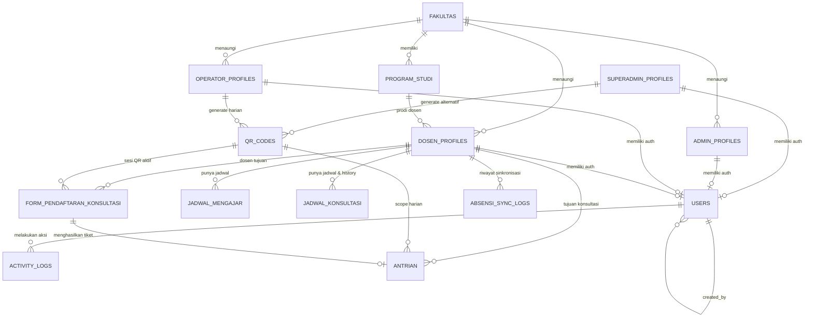

# ERD — Sistem Informasi Ketersediaan Dosen & Antrian Konsultasi (Sinkansen)

> Dokumen ini berisi Entity Relationship Diagram (ERD) lengkap untuk sistem
> Sinkansen versi revisi. Semua entitas, atribut, tipe data, constraint,
> dan relasi didokumentasikan secara rinci di sini.

---

## Ringkasan Perubahan Revisi

1. **Pemisahan Entitas Profil per Role**: Penambahan tabel `superadmin_profiles`, `admin_profiles`, dan `operator_profiles` berdampingan dengan `dosen_profiles`. Alur pembuatan akun: Superadmin/Admin membuat profil terlebih dahulu, kemudian akun autentikasi (`users`) dibuat dan di-link ke data profil tersebut (`user_id` nullable di awal).
2. **Kolom Prodi di Dosen Profile**: Penambahan relasi `prodi_id FK → program_studi(id)` dan `fakultas_id FK → fakultas(id)` pada `dosen_profiles`.
3. **History pada Jadwal Konsultasi**: Penambahan kolom `history_perubahan (JSONB)` serta status aktif/periode di tabel `jadwal_konsultasi`.
4. **Tabel Form Input Mahasiswa/Guest (`form_pendaftaran_konsultasi`)**: Form input pendaftaran mahasiswa sebelum mendapatkan nomor antrian, memiliki dependensi ke `qr_codes`, `dosen_profiles`, dan `program_studi`, yang selanjutnya menghasilkan tiket di tabel `antrian`.
5. **Relasi QR Code ke Operator & Superadmin**: Tabel `qr_codes` kini terhubung langsung ke `operator_profiles` dan `superadmin_profiles` via foreign key dan role generator.

---

## Daftar Entitas (15 Entitas)

| # | Entitas | Deskripsi | Relasi Utama |
|---|---|---|---|
| 1 | `users` | Kredensial akun autentikasi (email & password_hash) | Child 1:1 dari tabel-tabel profil, Parent dari `activity_logs` |
| 2 | `superadmin_profiles` | Profil Superadmin sistem | 1:1 ke `users`, Parent dari `qr_codes` |
| 3 | `admin_profiles` | Profil Administrator Fakultas | 1:1 ke `users`, Child dari `fakultas` |
| 4 | `operator_profiles` | Profil Operator Harian Display TV | 1:1 ke `users`, Child dari `fakultas`, Parent dari `qr_codes` |
| 5 | `dosen_profiles` | Profil Dosen & Status Ketersediaan | 1:1 ke `users`, Child dari `fakultas` & `program_studi`, Parent dari jadwal, form, antrian |
| 6 | `jadwal_mengajar` | Jadwal mengajar dosen mingguan | Child dari `dosen_profiles` |
| 7 | `jadwal_konsultasi` | Jadwal konsultasi dosen + kuota + history | Child dari `dosen_profiles` |
| 8 | `qr_codes` | QR code harian untuk registrasi antrian | Child dari `operator_profiles` / `superadmin_profiles`, Parent dari form pendaftaran |
| 9 | `form_pendaftaran_konsultasi` | Data formulir pendaftaran konsultasi guest/mahasiswa | Child dari `qr_codes`, `dosen_profiles`, Parent 1:1 dari `antrian` |
| 10 | `antrian` | Tiket antrian terverifikasi dan urutan panggilan | Child dari `form_pendaftaran_konsultasi`, `qr_codes`, `dosen_profiles` |
| 11 | `fakultas` | Master data fakultas | Parent dari `program_studi`, `admin_profiles`, `operator_profiles`, `dosen_profiles` |
| 12 | `program_studi` | Master data program studi | Child dari `fakultas`, Parent dari `dosen_profiles`, `form_pendaftaran_konsultasi` |
| 13 | `activity_logs` | Audit trail seluruh aksi operasional sistem | Child dari `users` |
| 14 | `system_settings` | Konfigurasi runtime sistem (key-value) | Child dari `users` (updated_by) |
| 15 | `absensi_sync_logs` | Log histori integrasi API absensi kampus | Child dari `dosen_profiles` |

---

## Diagram ER (Mermaid)



---

## Detail Entitas, Atribut & Constraint

### 1. `users` (Tabel Autentikasi / Kredensial)

Tabel khusus akun login autentikasi. Data profil identitas disimpan di masing-masing tabel profil. Akun dibuat setelah profil selesai dibuat oleh Superadmin/Admin.

| Kolom | Tipe Data | Constraint | Keterangan |
|---|---|---|---|
| `id` | `UUID` | `PRIMARY KEY`, `DEFAULT gen_random_uuid()` | Identifier unik akun |
| `email` | `VARCHAR(150)` | `NOT NULL`, `UNIQUE` | Email login sistem |
| `password_hash` | `VARCHAR(255)` | `NOT NULL` | Hash password (bcrypt/argon2) |
| `role` | `ENUM('superadmin','admin','dosen','operator')` | `NOT NULL` | Role pengguna |
| `is_active` | `BOOLEAN` | `NOT NULL`, `DEFAULT true` | Status keaktifan akun |
| `created_by` | `UUID` | `FK → users(id)`, `NULLABLE` | Akun pembuat (NULL untuk seed awal) |
| `created_at` | `TIMESTAMP` | `NOT NULL`, `DEFAULT NOW()` | Waktu pembuatan |
| `updated_at` | `TIMESTAMP` | `NOT NULL`, `DEFAULT NOW()` | Waktu pembaruan |

**Index:**
- `idx_users_email` — UNIQUE pada `email`
- `idx_users_role` — Index pada `role`

---

### 2. `superadmin_profiles`

Data profil personal Superadmin. Dibuat terlebih dahulu di panel Superadmin sebelum akun autentikasi `users` di-generate.

| Kolom | Tipe Data | Constraint | Keterangan |
|---|---|---|---|
| `id` | `UUID` | `PRIMARY KEY`, `DEFAULT gen_random_uuid()` | ID profil superadmin |
| `user_id` | `UUID` | `FK → users(id)`, `UNIQUE`, `NULLABLE` | Di-link setelah akun auth dibuat |
| `nama_lengkap` | `VARCHAR(100)` | `NOT NULL` | Nama lengkap superadmin |
| `no_telepon` | `VARCHAR(20)` | `NULLABLE` | Kontak HP/WhatsApp |
| `foto_url` | `VARCHAR(500)` | `NULLABLE` | URL avatar profil |
| `created_at` | `TIMESTAMP` | `NOT NULL`, `DEFAULT NOW()` | Waktu profil didaftarkan |
| `updated_at` | `TIMESTAMP` | `NOT NULL`, `DEFAULT NOW()` | Waktu profil diubah |

---

### 3. `admin_profiles`

Data profil Administrator di tingkat Fakultas.

| Kolom | Tipe Data | Constraint | Keterangan |
|---|---|---|---|
| `id` | `UUID` | `PRIMARY KEY`, `DEFAULT gen_random_uuid()` | ID profil admin |
| `user_id` | `UUID` | `FK → users(id)`, `UNIQUE`, `NULLABLE` | Di-link setelah akun auth dibuat |
| `nama_lengkap` | `VARCHAR(100)` | `NOT NULL` | Nama lengkap admin |
| `nip` | `VARCHAR(30)` | `UNIQUE`, `NULLABLE` | NIP / Identitas kepegawaian |
| `fakultas_id` | `UUID` | `FK → fakultas(id)`, `NOT NULL` | Lingkup wewenang fakultas |
| `no_telepon` | `VARCHAR(20)` | `NULLABLE` | Nomor kontak |
| `foto_url` | `VARCHAR(500)` | `NULLABLE` | URL foto profil |
| `created_at` | `TIMESTAMP` | `NOT NULL`, `DEFAULT NOW()` | Waktu dibuat |
| `updated_at` | `TIMESTAMP` | `NOT NULL`, `DEFAULT NOW()` | Waktu diupdate |

**Index:**
- `idx_admin_fakultas` — Index pada `fakultas_id`

---

### 4. `operator_profiles`

Data profil Operator yang bertugas mengelola Display TV dan generate QR Code harian di kampus/fakultas.

| Kolom | Tipe Data | Constraint | Keterangan |
|---|---|---|---|
| `id` | `UUID` | `PRIMARY KEY`, `DEFAULT gen_random_uuid()` | ID profil operator |
| `user_id` | `UUID` | `FK → users(id)`, `UNIQUE`, `NULLABLE` | Di-link setelah akun auth dibuat |
| `nama_lengkap` | `VARCHAR(100)` | `NOT NULL` | Nama lengkap operator |
| `nomor_identitas` | `VARCHAR(30)` | `NULLABLE` | NIP / ID Staf Tenaga Kependidikan |
| `fakultas_id` | `UUID` | `FK → fakultas(id)`, `NOT NULL` | Fakultas penugasan operator |
| `no_telepon` | `VARCHAR(20)` | `NULLABLE` | Nomor kontak aktif |
| `created_at` | `TIMESTAMP` | `NOT NULL`, `DEFAULT NOW()` | Waktu dibuat |
| `updated_at` | `TIMESTAMP` | `NOT NULL`, `DEFAULT NOW()` | Waktu diupdate |

**Index:**
- `idx_operator_fakultas` — Index pada `fakultas_id`

---

### 5. `dosen_profiles`

Data profil lengkap Dosen beserta status ketersediaan live dan afiliasi program studi.

| Kolom | Tipe Data | Constraint | Keterangan |
|---|---|---|---|
| `id` | `UUID` | `PRIMARY KEY`, `DEFAULT gen_random_uuid()` | ID profil dosen |
| `user_id` | `UUID` | `FK → users(id)`, `UNIQUE`, `NULLABLE` | Di-link setelah akun auth dibuat |
| `nama_lengkap` | `VARCHAR(100)` | `NOT NULL` | Nama dan gelar dosen |
| `nip` | `VARCHAR(30)` | `NOT NULL`, `UNIQUE` | NIP / NIDN resmi dosen |
| `fakultas_id` | `UUID` | `FK → fakultas(id)`, `NOT NULL` | Asal fakultas |
| `prodi_id` | `UUID` | `FK → program_studi(id)`, `NOT NULL` | **Kolom Prodi** dosen |
| `kode_antrian` | `CHAR(3)` | `NOT NULL`, `UNIQUE` | Prefix nomor antrian dosen (misal `A`, `B`) |
| `foto_url` | `VARCHAR(500)` | `NULLABLE` | URL foto resmi dosen |
| `status_ketersediaan` | `ENUM('tersedia','mengajar','tidak_bersedia','pulang')` | `NOT NULL`, `DEFAULT 'pulang'` | Status live ketersediaan |
| `status_override` | `BOOLEAN` | `NOT NULL`, `DEFAULT false` | True = status diubah manual oleh dosen |
| `is_absen_masuk` | `BOOLEAN` | `NOT NULL`, `DEFAULT false` | Flag tap hadir dari API absensi kampus |
| `status_updated_at` | `TIMESTAMP` | `NOT NULL`, `DEFAULT NOW()` | Terakhir status diubah/dievaluasi |
| `created_at` | `TIMESTAMP` | `NOT NULL`, `DEFAULT NOW()` | Waktu pendaftaran profil |
| `updated_at` | `TIMESTAMP` | `NOT NULL`, `DEFAULT NOW()` | Waktu pembaruan profil |

**Index:**
- `idx_dosen_nip` — UNIQUE pada `nip`
- `idx_dosen_kode_antrian` — UNIQUE pada `kode_antrian`
- `idx_dosen_prodi` — Index pada `prodi_id`
- `idx_dosen_fakultas` — Index pada `fakultas_id`
- `idx_dosen_status` — Index pada `status_ketersediaan`

---

### 6. `jadwal_mengajar`

Jadwal mengajar mingguan dosen.

| Kolom | Tipe Data | Constraint | Keterangan |
|---|---|---|---|
| `id` | `UUID` | `PRIMARY KEY`, `DEFAULT gen_random_uuid()` | |
| `dosen_id` | `UUID` | `FK → dosen_profiles(id)`, `NOT NULL` | |
| `hari` | `ENUM('senin','selasa','rabu','kamis','jumat','sabtu','minggu')` | `NOT NULL` | Hari mengajar |
| `jam_mulai` | `TIME` | `NOT NULL` | Jam mulai kuliah |
| `jam_selesai` | `TIME` | `NOT NULL` | Jam selesai (harus > `jam_mulai`) |
| `mata_kuliah` | `VARCHAR(100)` | `NOT NULL` | Nama mata kuliah |
| `created_at` | `TIMESTAMP` | `NOT NULL`, `DEFAULT NOW()` | |
| `updated_at` | `TIMESTAMP` | `NOT NULL`, `DEFAULT NOW()` | |

**Constraint:**
- `CHECK (jam_selesai > jam_mulai)`

---

### 7. `jadwal_konsultasi`

Jadwal konsultasi mingguan dosen dilengkapi pelacakan history modifikasi jadwal.

| Kolom | Tipe Data | Constraint | Keterangan |
|---|---|---|---|
| `id` | `UUID` | `PRIMARY KEY`, `DEFAULT gen_random_uuid()` | |
| `dosen_id` | `UUID` | `FK → dosen_profiles(id)`, `NOT NULL` | |
| `hari` | `ENUM('senin','selasa','rabu','kamis','jumat','sabtu','minggu')` | `NOT NULL` | Hari buka konsultasi |
| `jam_mulai` | `TIME` | `NOT NULL` | Jam mulai konsultasi |
| `jam_selesai` | `TIME` | `NOT NULL` | Jam selesai konsultasi |
| `kuota_harian` | `INTEGER` | `NULLABLE` | Kuota antrian maksimal (NULL = tanpa batas) |
| `history_perubahan` | `JSONB` | `NULLABLE` | **Kolom History**: log audit perubahan jadwal & kuota |
| `is_active` | `BOOLEAN` | `NOT NULL`, `DEFAULT true` | Status keaktifan jadwal periode ini |
| `created_at` | `TIMESTAMP` | `NOT NULL`, `DEFAULT NOW()` | |
| `updated_at` | `TIMESTAMP` | `NOT NULL`, `DEFAULT NOW()` | |

**Contoh Format Kolom `history_perubahan` (JSONB):**
```json
[
  {
    "action": "UPDATE_JADWAL",
    "changed_at": "2026-09-10T08:30:00Z",
    "changed_by": "uuid-user",
    "previous_values": { "jam_mulai": "09:00", "jam_selesai": "11:00", "kuota": 10 },
    "new_values": { "jam_mulai": "10:00", "jam_selesai": "12:00", "kuota": 15 },
    "reason": "Penyesuaian jam rapat jurusan"
  }
]
```

---

### 8. `qr_codes`

Tabel QR code harian. Terhubung langsung ke tabel profil pembuat (`operator_profiles` atau `superadmin_profiles`).

| Kolom | Tipe Data | Constraint | Keterangan |
|---|---|---|---|
| `id` | `UUID` | `PRIMARY KEY`, `DEFAULT gen_random_uuid()` | ID unik record QR |
| `kode_unik` | `VARCHAR(64)` | `NOT NULL`, `UNIQUE` | Random secure string untuk payload QR scan |
| `generated_by_role` | `ENUM('operator','superadmin')` | `NOT NULL` | Role pihak pembuat QR |
| `operator_id` | `UUID` | `FK → operator_profiles(id)`, `NULLABLE` | Terisi jika dibuat oleh Operator |
| `superadmin_id` | `UUID` | `FK → superadmin_profiles(id)`, `NULLABLE` | Terisi jika dibuat oleh Superadmin |
| `tanggal_berlaku` | `DATE` | `NOT NULL` | Tanggal validitas hari tersebut |
| `expired_at` | `TIMESTAMP` | `NOT NULL` | Waktu kedaluwarsa (misal 23:59) |
| `status` | `ENUM('aktif','expired')` | `NOT NULL`, `DEFAULT 'aktif'` | Status masa berlaku |
| `created_at` | `TIMESTAMP` | `NOT NULL`, `DEFAULT NOW()` | Waktu digenerate |

**Constraint & Index:**
- `CHECK ((operator_id IS NOT NULL AND superadmin_id IS NULL) OR (superadmin_id IS NOT NULL AND operator_id IS NULL))`
- `idx_qr_kode_unik` — UNIQUE pada `kode_unik`
- `idx_qr_tanggal_aktif` — Partial UNIQUE index: `UNIQUE (tanggal_berlaku) WHERE status = 'aktif'`

---

### 9. `form_pendaftaran_konsultasi` (Input Form Guest/Mahasiswa)

Tabel formulir pendaftaran konsultasi mahasiswa sebelum diterbitkan nomor antrian. Berelasi dengan QR Code yang discan dan Dosen tujuan.

| Kolom | Tipe Data | Constraint | Keterangan |
|---|---|---|---|
| `id` | `UUID` | `PRIMARY KEY`, `DEFAULT gen_random_uuid()` | ID formulir pendaftaran |
| `qr_code_id` | `UUID` | `FK → qr_codes(id)`, `NOT NULL` | Validasi QR sesi harian |
| `dosen_id` | `UUID` | `FK → dosen_profiles(id)`, `NOT NULL` | Dosen yang dituju (berdasarkan `dosen_id`) |
| `nama` | `VARCHAR(100)` | `NOT NULL` | Nama mahasiswa |
| `nim` | `VARCHAR(20)` | `NOT NULL` | Nomor Induk Mahasiswa |
| `perihal` | `VARCHAR(255)` | `NOT NULL` | Pokok / topik keperluan konsultasi |
| `keterangan` | `TEXT` | `NULLABLE` | Keterangan detail konsultasi |
| `created_at` | `TIMESTAMP` | `NOT NULL`, `DEFAULT NOW()` | Waktu pengisian form |

**Index:**
- `idx_form_dosen_tanggal` — Index pada `(dosen_id, created_at)`
- `idx_form_nim` — Index pada `nim`

**Business Rules Form Pendaftaran:**
- **Filtering Dropdown Dosen**: Pilihan dosen pada form **hanya menampilkan dosen yang berstatus `tersedia`, `mengajar`, dan `tidak_bersedia`**. Dosen yang berstatus `pulang` (tidak di tempat / belum hadir) otomatis di-filter dan **tidak muncul di menu pilihan form**.
- **Pendaftaran Selalu Berhasil (Auto Success)**: Pengisian formulir tidak memiliki status bertahap/alasan penolakan. Setiap kali form berhasil disubmit, data langsung tercatat dan secara instan menerbitkan tiket nomor antrian di tabel `antrian`.

---

### 10. `antrian` (Tiket Antrian Konsultasi)

Tabel tiket antrian resmi yang digenerate setelah data form pendaftaran mahasiswa divalidasi.

| Kolom | Tipe Data | Constraint | Keterangan |
|---|---|---|---|
| `id` | `UUID` | `PRIMARY KEY`, `DEFAULT gen_random_uuid()` | ID tiket antrian |
| `form_pendaftaran_id` | `UUID` | `FK → form_pendaftaran_konsultasi(id)`, `NOT NULL`, `UNIQUE` | Relasi 1:1 ke form pendaftaran |
| `qr_code_id` | `UUID` | `FK → qr_codes(id)`, `NOT NULL` | QR sesi harian |
| `dosen_id` | `UUID` | `FK → dosen_profiles(id)`, `NOT NULL` | Dosen tujuan |
| `nomor_antrian` | `VARCHAR(10)` | `NOT NULL` | Format kode: `[KODE_DOSEN]-[URUTAN]` (contoh: `A-01`) |
| `urutan` | `INTEGER` | `NOT NULL` | Nomor urut sequential per dosen per hari |
| `status` | `ENUM('menunggu','dipanggil','selesai','tidak_hadir','dilewati')` | `NOT NULL`, `DEFAULT 'menunggu'` | Status operasional antrian |
| `tanggal` | `DATE` | `NOT NULL`, `DEFAULT CURRENT_DATE` | Tanggal antrian |
| `created_at` | `TIMESTAMP` | `NOT NULL`, `DEFAULT NOW()` | Waktu antrian diterbitkan |
| `dipanggil_at` | `TIMESTAMP` | `NULLABLE` | Waktu pertama kali nomor dipanggil |
| `selesai_at` | `TIMESTAMP` | `NULLABLE` | Waktu konsultasi diselesaikan |

**Index:**
- `idx_antrian_dosen_tanggal_urutan` — UNIQUE pada `(dosen_id, tanggal, urutan)`
- `idx_antrian_status_tanggal` — Index pada `(tanggal, status)`

---

### 11. `fakultas`

Master data fakultas.

| Kolom | Tipe Data | Constraint | Keterangan |
|---|---|---|---|
| `id` | `UUID` | `PRIMARY KEY`, `DEFAULT gen_random_uuid()` | |
| `nama` | `VARCHAR(100)` | `NOT NULL` | Nama fakultas |
| `kode` | `VARCHAR(10)` | `NOT NULL`, `UNIQUE` | Kode singkatan fakultas |

---

### 12. `program_studi`

Master data program studi.

| Kolom | Tipe Data | Constraint | Keterangan |
|---|---|---|---|
| `id` | `UUID` | `PRIMARY KEY`, `DEFAULT gen_random_uuid()` | |
| `nama` | `VARCHAR(100)` | `NOT NULL` | Nama program studi |
| `kode` | `VARCHAR(10)` | `NOT NULL`, `UNIQUE` | Kode prodi |
| `fakultas_id` | `UUID` | `FK → fakultas(id)`, `NOT NULL` | Fakultas penaung |

---

### 13. `activity_logs`

Audit trail untuk seluruh aksi pengguna.

| Kolom | Tipe Data | Constraint | Keterangan |
|---|---|---|---|
| `id` | `UUID` | `PRIMARY KEY`, `DEFAULT gen_random_uuid()` | |
| `user_id` | `UUID` | `FK → users(id)`, `NULLABLE` | Akun pelaku aksi (NULL jika sistem/scheduler) |
| `aksi` | `VARCHAR(50)` | `NOT NULL` | Kode aksi (misal: `CREATE_PROFILE`, `GENERATE_QR`, `CALL_QUEUE`) |
| `target_entity` | `VARCHAR(50)` | `NOT NULL` | Tabel target |
| `target_id` | `VARCHAR(50)` | `NOT NULL` | ID target |
| `detail` | `JSONB` | `NULLABLE` | Snapshot perubahan data |
| `ip_address` | `VARCHAR(45)` | `NULLABLE` | IP pelaku |
| `created_at` | `TIMESTAMP` | `NOT NULL`, `DEFAULT NOW()` | |

---

### 14. `system_settings`

Tabel konfigurasi key-value.

| Kolom | Tipe Data | Constraint | Keterangan |
|---|---|---|---|
| `id` | `BIGINT` | `PRIMARY KEY`, `GENERATED ALWAYS AS IDENTITY` | |
| `key` | `VARCHAR(50)` | `NOT NULL`, `UNIQUE` | Key setting |
| `value` | `TEXT` | `NOT NULL` | Nilai setting |
| `description` | `TEXT` | `NULLABLE` | Keterangan konfigurasi |
| `updated_by` | `UUID` | `FK → users(id)`, `NULLABLE` | Akun pengubah terakhir |
| `updated_at` | `TIMESTAMP` | `NOT NULL`, `DEFAULT NOW()` | |

---

### 15. `absensi_sync_logs`

Log histori sinkronisasi integrasi API absensi kampus.

| Kolom | Tipe Data | Constraint | Keterangan |
|---|---|---|---|
| `id` | `UUID` | `PRIMARY KEY`, `DEFAULT gen_random_uuid()` | |
| `dosen_id` | `UUID` | `FK → dosen_profiles(id)`, `NULLABLE` | Dosen terkait |
| `event_type` | `ENUM('masuk','pulang')` | `NOT NULL` | Tipe event absensi |
| `source` | `ENUM('polling','webhook')` | `NOT NULL` | Sumber sync |
| `raw_payload` | `JSONB` | `NOT NULL` | Payload mentah dari API kampus |
| `sync_status` | `ENUM('success','failed','ignored')` | `NOT NULL` | Hasil evaluasi sinkronisasi |
| `error_message` | `TEXT` | `NULLABLE` | Pesan kegagalan jika error |
| `status_before` | `ENUM('tersedia','mengajar','tidak_tersedia','pulang')` | `NULLABLE` | Status sebelum event |
| `status_after` | `ENUM('tersedia','mengajar','tidak_bersedia','pulang')` | `NULLABLE` | Status setelah event |
| `synced_at` | `TIMESTAMP` | `NOT NULL`, `DEFAULT NOW()` | Waktu sync dieksekusi |

---

## Ringkasan Relasi Lengkap

| Parent Table | Child Table | Kardinalitas | FK Column | On Delete | Keterangan |
|---|---|---|---|---|---|
| `fakultas` | `program_studi` | 1 : N | `fakultas_id` | RESTRICT | 1 fakultas memiliki banyak prodi |
| `fakultas` | `admin_profiles` | 1 : N | `fakultas_id` | RESTRICT | Lingkup admin fakultas |
| `fakultas` | `operator_profiles` | 1 : N | `fakultas_id` | RESTRICT | Lingkup operator fakultas |
| `fakultas` | `dosen_profiles` | 1 : N | `fakultas_id` | RESTRICT | Afiliasi fakultas dosen |
| `program_studi` | `dosen_profiles` | 1 : N | `prodi_id` | RESTRICT | Homebase prodi dosen |
| `users` | `superadmin_profiles` | 1 : 1 | `user_id` | SET NULL | Profil superadmin terhubung ke auth |
| `users` | `admin_profiles` | 1 : 1 | `user_id` | SET NULL | Profil admin terhubung ke auth |
| `users` | `operator_profiles` | 1 : 1 | `user_id` | SET NULL | Profil operator terhubung ke auth |
| `users` | `dosen_profiles` | 1 : 1 | `user_id` | SET NULL | Profil dosen terhubung ke auth |
| `operator_profiles` | `qr_codes` | 1 : N | `operator_id` | RESTRICT | QR yang dibuat operator |
| `superadmin_profiles` | `qr_codes` | 1 : N | `superadmin_id` | RESTRICT | QR yang dibuat superadmin |
| `qr_codes` | `form_pendaftaran_konsultasi` | 1 : N | `qr_code_id` | RESTRICT | Pendaftaran via QR sesi aktif |
| `qr_codes` | `antrian` | 1 : N | `qr_code_id` | RESTRICT | Tiket dalam sesi QR aktif |
| `form_pendaftaran_konsultasi` | `antrian` | 1 : 1 | `form_pendaftaran_id`| RESTRICT | 1 form menghasilkan 1 tiket antrian |
| `dosen_profiles` | `jadwal_mengajar` | 1 : N | `dosen_id` | CASCADE | Jadwal mengajar dosen |
| `dosen_profiles` | `jadwal_konsultasi` | 1 : N | `dosen_id` | CASCADE | Jadwal konsultasi & history dosen |
| `dosen_profiles` | `form_pendaftaran_konsultasi` | 1 : N | `dosen_id` | RESTRICT | Dosen tujuan konsultasi |
| `dosen_profiles` | `antrian` | 1 : N | `dosen_id` | RESTRICT | Dosen pelayan konsultasi |
| `dosen_profiles` | `absensi_sync_logs` | 1 : N | `dosen_id` | SET NULL | Log sinkronisasi dosen |
| `users` | `activity_logs` | 1 : N | `user_id` | SET NULL | Audit trail user |
| `users` | `users` | 1 : N | `created_by` | SET NULL | Self-reference pembuat akun |

---

## Enum Definitions (PostgreSQL DDL)

```sql
-- Role akun sistem
CREATE TYPE user_role AS ENUM ('superadmin', 'admin', 'dosen', 'operator');

-- Role pembuat QR Code
CREATE TYPE qr_generator_role AS ENUM ('operator', 'superadmin');

-- Status ketersediaan live dosen
CREATE TYPE status_ketersediaan AS ENUM ('tersedia', 'mengajar', 'tidak_bersedia', 'pulang');

-- Hari operasional
CREATE TYPE hari_enum AS ENUM ('senin', 'selasa', 'rabu', 'kamis', 'jumat', 'sabtu', 'minggu');

-- Status QR Code
CREATE TYPE qr_status AS ENUM ('aktif', 'expired');

-- Status antrian operasional
CREATE TYPE antrian_status AS ENUM ('menunggu', 'dipanggil', 'selesai', 'tidak_hadir', 'dilewati');

-- Event tipe absensi dari kampus
CREATE TYPE absensi_event AS ENUM ('masuk', 'pulang');

-- Jalur sinkronisasi absensi
CREATE TYPE sync_source AS ENUM ('polling', 'webhook');

-- Status hasil eksekusi sync absensi
CREATE TYPE sync_status AS ENUM ('success', 'failed', 'ignored');
```
