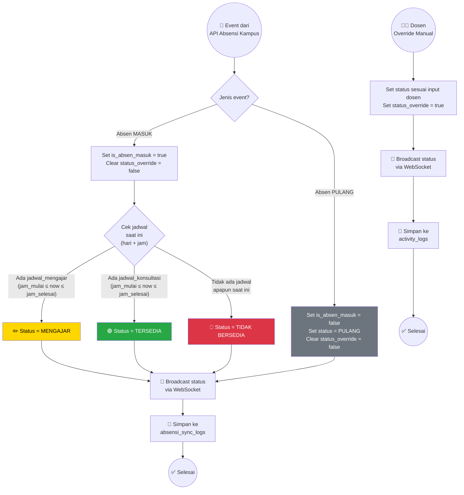
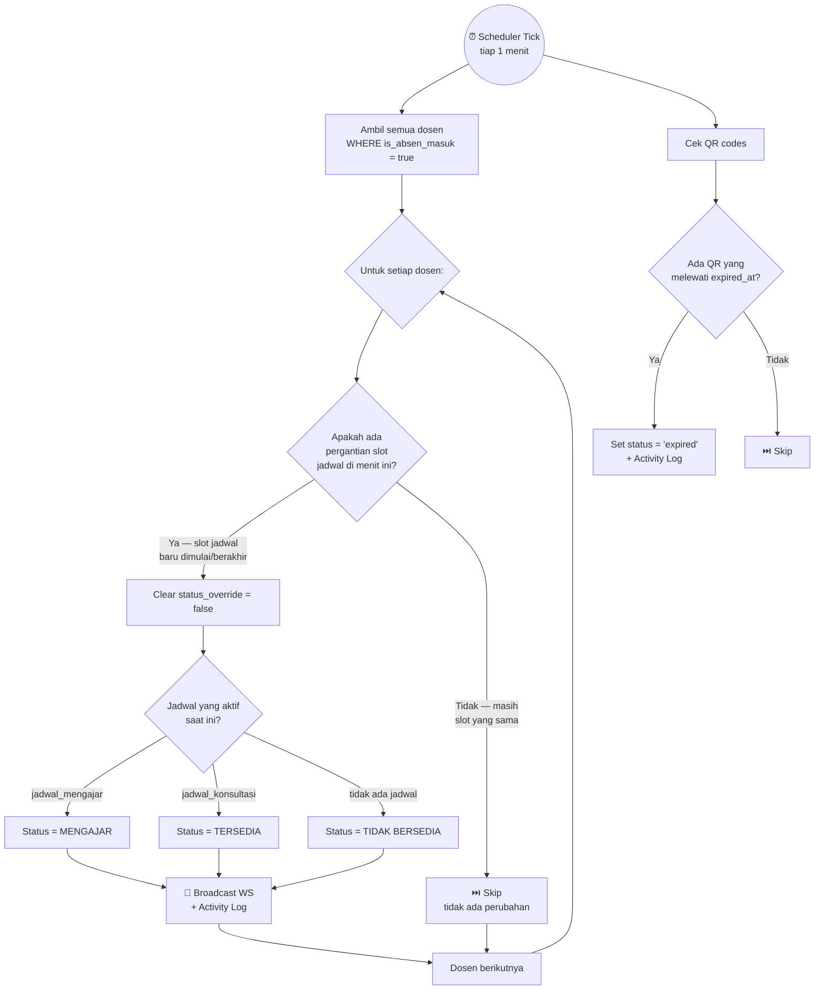
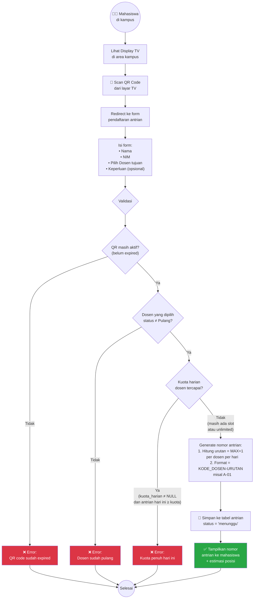
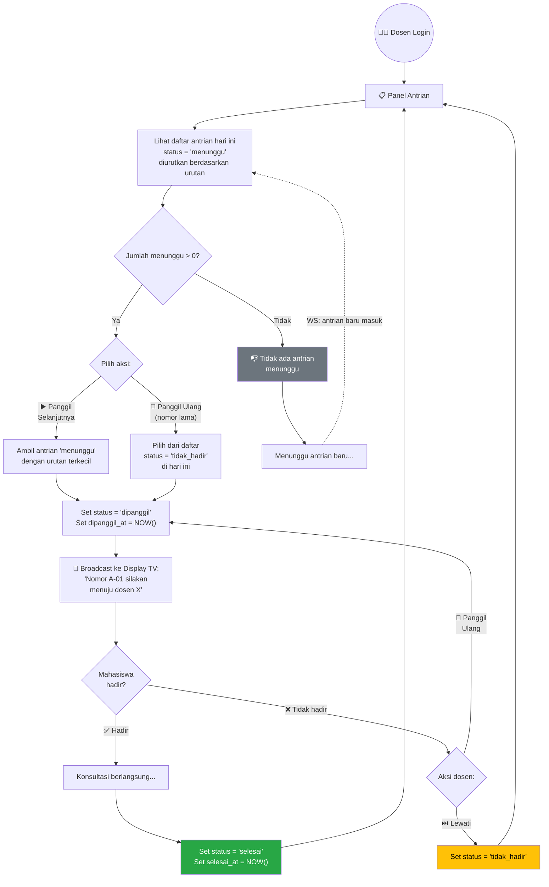
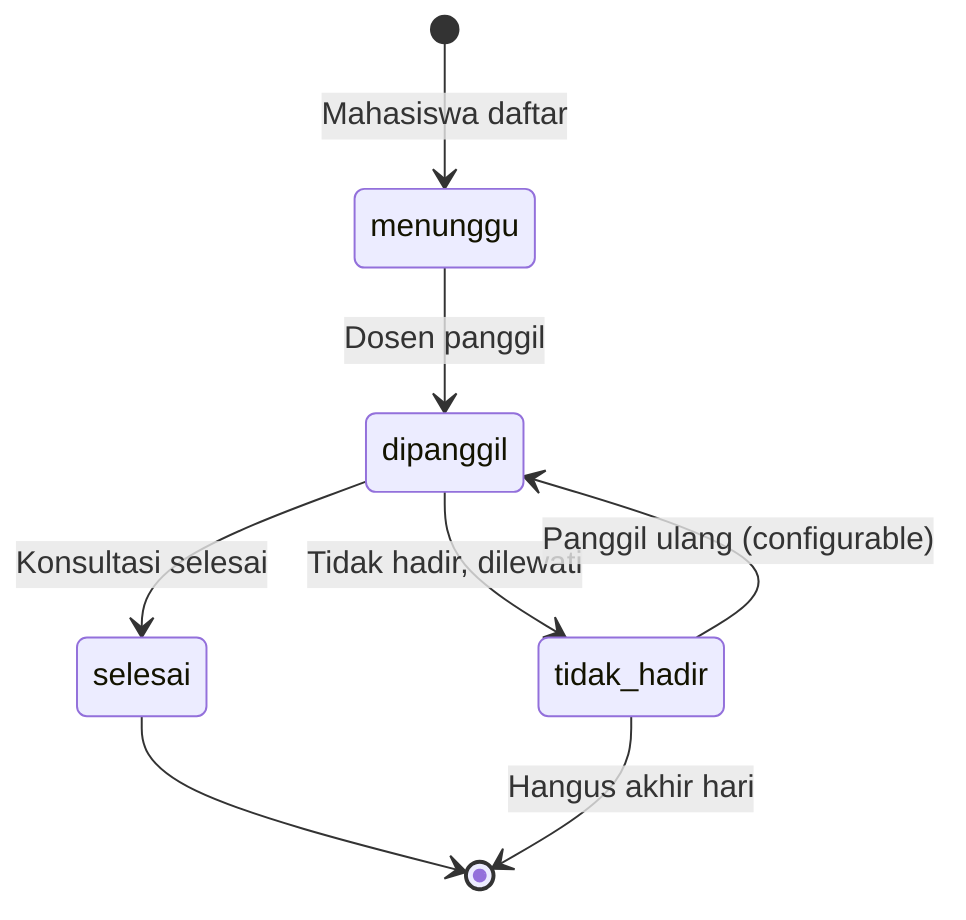
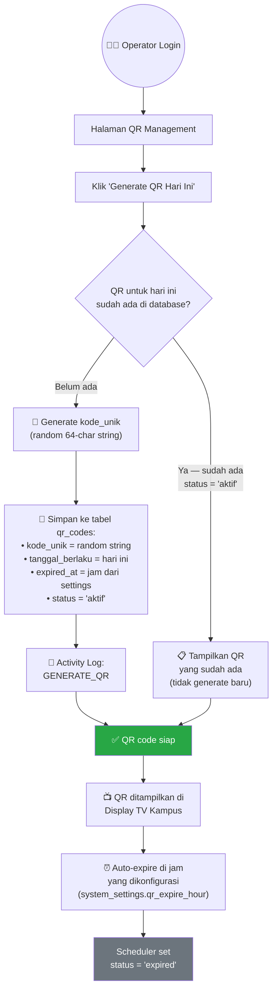
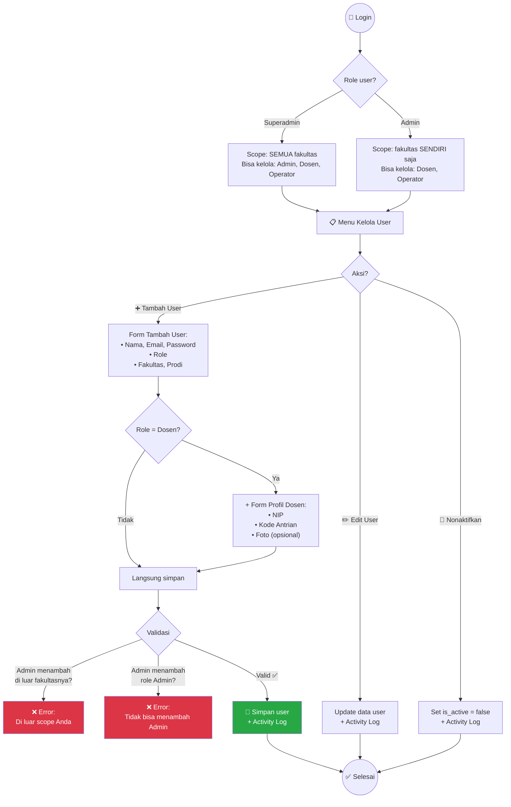

# Flowcharts — Sistem Ketersediaan & Antrian Konsultasi Dosen

> Dokumen ini berisi semua flowchart alur bisnis utama dalam sistem,
> divisualisasikan menggunakan diagram Mermaid.

---

## Daftar Flowchart

| # | Flowchart | Deskripsi |
|---|---|---|
| 1 | State Machine Status Dosen | Logika penentuan status dosen (API absensi + jadwal + override) |
| 2 | Scheduler Periodik | Proses cron tiap menit (evaluasi status + expire QR) |
| 3 | Registrasi Antrian | Alur mahasiswa mendaftar antrian via QR |
| 4 | Panggilan Antrian | Alur dosen memanggil & mengelola antrian |
| 5 | Generate QR Code | Alur operator generate QR harian |
| 6 | Manajemen User | Alur admin/superadmin mengelola akun pengguna |

---

## 1. State Machine Status Dosen

Sumber utama status dosen adalah **API absensi kampus**. Jadwal mengajar dan konsultasi digunakan sebagai **referensi** untuk menentukan status spesifik setelah dosen absen masuk.

### Aturan Override

| Aturan | Penjelasan |
|---|---|
| Override berlaku sampai trigger berikutnya | Override di-clear saat: pergantian slot jadwal (scheduler) ATAU event baru dari API absensi |
| Prioritas: API absensi > Override | Jika API mengirim event "pulang", override apapun langsung di-clear dan status = PULANG |
| Override tidak mengubah `is_absen_masuk` | Override hanya mengubah `status_ketersediaan` dan set `status_override = true` |

---

## 2. Scheduler Periodik (Cron Tiap Menit)

Scheduler berjalan sebagai background job, mengecek apakah ada **pergantian slot jadwal** untuk dosen yang sudah absen masuk, dan meng-expire QR code yang sudah melewati batas waktu.

### Prioritas Jadwal

Jika jadwal mengajar dan jadwal konsultasi **overlap** di waktu yang sama:

| Prioritas | Alasan |
|---|---|
| `jadwal_mengajar` lebih tinggi | Mengajar adalah aktivitas utama yang tidak bisa diinterupsi |

---

## 3. Alur Registrasi Antrian (Mahasiswa / Guest)

Mahasiswa **tidak perlu login**. Akses antrian hanya via scan QR fisik di Display TV Kampus.

### Catatan Penting

> **Dosen yang bisa dipilih di form:** Semua status KECUALI "Pulang"
> - ✅ Tersedia — bisa langsung dilayani
> - ✅ Mengajar — mahasiswa antre dulu, nanti dipanggil setelah selesai mengajar
> - ✅ Tidak Bersedia — mahasiswa antre dulu
> - ❌ Pulang — tidak muncul di pilihan

---

## 4. Alur Panggilan Antrian (Dosen)

Dosen mengelola antrian konsultasi dari panel khusus setelah login.

### Status Transition Antrian

---

## 5. Alur Generate QR Code (Operator)

Operator meng-generate satu QR code per hari untuk ditampilkan di Display TV Kampus.

### Catatan QR Code

| Aturan | Penjelasan |
|---|---|
| 1 QR per hari | Enforced via database constraint |
| QR hanya di TV | **TIDAK PERNAH** tampil di landing page publik/online |
| Expired otomatis | Scheduler cek tiap menit, expire jika `NOW() > expired_at` |
| URL format | `https://[domain]/antrian?qr=[kode_unik]` |

---

## 6. Alur Manajemen User (Superadmin / Admin)

### Matriks Kewenangan

| Aksi | Superadmin | Admin |
|---|---|---|
| Tambah Admin | ✅ | ❌ |
| Tambah Dosen | ✅ Semua fakultas | ✅ Fakultas sendiri |
| Tambah Operator | ✅ Semua fakultas | ✅ Fakultas sendiri |
| Edit user | ✅ Semua | ✅ Fakultas sendiri |
| Nonaktifkan user | ✅ Semua | ✅ Fakultas sendiri |
| Lihat audit log | ✅ Global | ✅ Scope fakultas |
