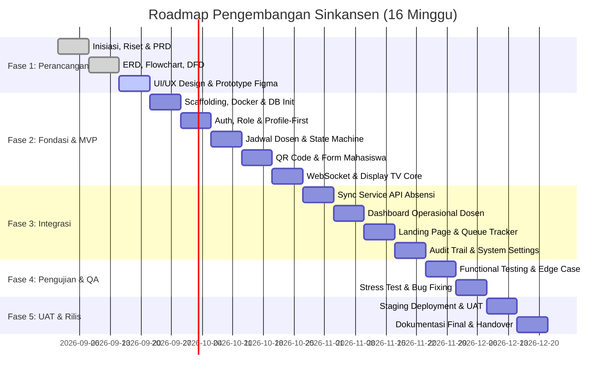

# 📄 Product Requirement Document (PRD)
## Sinkansen — Sistem Informasi Ketersediaan Dosen & Antrian Konsultasi

---

## 1. Informasi Dokumen & Kontrol Versi

| Atribut | Keterangan |
|---|---|
| **Nama Produk** | **Sinkansen** (Sistem Informasi Ketersediaan Dosen & Antrian Konsultasi) |
| **Versi Dokumen** | 1.0 (Final Draft) |
| **Status** | Approved for Development |
| **Tanggal Pembuatan**| September 2026 |
| **Repositori** | [github.com/Cahyadi-Prasetyo/sinkansen](https://github.com/Cahyadi-Prasetyo/sinkansen) |
| **Penulis & Tim** | **Cahyadi Prasetyo** (PM & BE) **Elfa Dwi Cahyani** (FE) **Meyza Zaharani** (UI/UX) **Laras Anditta P** (UI/UX) **Widuri Eka** (QA) |

---

## 2. Latar Belakang & Problem Statement

### 2.1. Latar Belakang
Di lingkungan perguruan tinggi, proses bimbingan skripsi, tugas akhir, dan konsultasi akademik antara dosen dan mahasiswa seringkali mengalami hambatan komunikasi. Mahasiswa kerap kali datang ke ruang dosen tanpa kepastian apakah dosen yang bersangkutan sedang berada di kampus, sedang mengajar di kelas, atau sedang membuka sesi konsultasi. Hal ini menyebabkan antrian fisik yang menumpuk di lorong ruang dosen, waktu tunggu yang terbuang, serta beban interupsi kerja bagi para dosen.

### 2.2. Problem Statement
1. **Ketidakpastian Kehadiran Dosen:** Mahasiswa tidak memiliki akses informasi real-time mengenai status kehadiran fisik dan aktivitas dosen di kampus.
2. **Antrian Manual Tidak Terkelola:** Konsultasi berjalan dengan sistem "siapa cepat dia dapat" tanpa nomor urut jelas, rawan saling serobot, dan menyulitkan dosen mengatur alokasi waktu konsultasi.
3. **Data Absensi Terisolasi:** Kampus telah memiliki sistem absensi tap pegawai (masuk/pulang), namun datanya belum terintegrasi ke sistem informasi publik mahasiswa.
4. **Hambatan Akses Aplikasi:** Sistem antrian konvensional seringkali menuntut mahasiswa mengunduh aplikasi atau membuat akun baru yang memperlambat proses pendaftaran.

---

## 3. Visi Produk, Goals & Non-Goals

### 3.1. Visi Produk
Menghadirkan ekosistem kampus cerdas (*smart campus*) yang transparan dan efisien melalui sistem pelacakan ketersediaan dosen otomatis dan tata kelola antrian konsultasi berbasis web mobile-friendly tanpa proses registrasi akun bagi mahasiswa.

### 3.2. Product Goals
- Menyajikan status ketersediaan dosen secara **real-time** (`TERSEDIA`, `MENGAJAR`, `TIDAK BERSEDIA`, `PULANG`) dengan delay pembaruan < 1 detik via WebSocket.
- Menghubungkan kehadiran dosen secara otomatis dengan **API Absensi Kampus**.
- Memfasilitasi pendaftaran antrian mandiri (*self-service*) oleh mahasiswa melalui **pemindaian QR Code harian di Display TV kampus** menggunakan perangkat mobile pribadi.
- Memberikan kendali pemanggilan nomor antrian dan pengaturan jadwal yang fleksibel bagi dosen.
- Memungkinkan deployment yang mandiri (*self-hosted*) menggunakan Docker di infrastruktur lokal kampus.

### 3.3. Non-Goals (Batasan Scope)
- **Tidak mencakup pelacakan lokasi/ruangan fisik dosen** (tabel ruangan ditiadakan sesuai keputusan bisnis).
- **Tidak menyediakan booking/reservasi hari depan** (antrian bersifat harian / *same-day queue*).
- **Tidak ada akun login untuk Mahasiswa/Guest** (akses publik murni berbasis token QR harian).
- **Tidak menggantikan sistem absensi resmi kampus** (sistem hanya bertindak sebagai *consumer* event absensi).

---

## 4. Target Audiens & User Persona

| Persona | Profil & Karakteristik | Kebutuhan Utama | Pain Points |
|---|---|---|---|
| **Mahasiswa (Guest)** | Mahasiswa aktif yang membutuhkan konsultasi KRS, tugas akhir, atau bimbingan akademik. Menggunakan smartphone. | Tahu status dosen live, daftar antrian cepat via scan QR, pantau nomor antrian dari HP. | Menunggu berjam-jam di depan ruang dosen, dosen ternyata tidak ada di tempat. |
| **Dosen** | Tenaga pendidik dengan mobilitas tinggi antara mengajar, rapat, dan riset. | Mengatur kuota bimbingan, memanggil antrian teratur, override status jika ada urusan mendadak. | Terganggu oleh mahasiswa yang mengetuk pintu saat sedang fokus atau mengajar. |
| **Operator Kampus** | Staf tata usaha / laboran fakultas yang bertugas menjaga layar Display TV. | Kemudahan generate QR Code harian dan memantau koneksi Display TV di lorong. | Proses administratif manual yang repetitif setiap hari. |
| **Admin Fakultas** | Pimpinan jurusan / fakultas yang mengelola data staf pengajar. | Manajemen akun dosen dan operator dalam lingkup fakultasnya. | Sulit memantau keaktifan konsultasi dosen di fakultasnya. |
| **Superadmin** | Tim IT/Pustik kampus pengelola server dan arsitektur data global. | Manajemen akun multi-fakultas, audit trail, konfigurasi integrasi API absensi kampus. | Sistem rumit yang sulit di-maintain di server lokal. |

---

## 5. User Stories & Acceptance Criteria

### US-01: Mahasiswa Mengakses Landing Page Publik & Mendaftar Antrian di Monitor Kampus
> **Sebagai** Mahasiswa (Guest),  
> **Saya ingin** melihat ketersediaan dosen dan nama mahasiswa yang sedang berkonsultasi via landing page publik di ponsel saya, serta memindai QR Code di layar monitor kampus jika ingin mendaftar antrian,  
> **Agar** saya memperoleh kepastian konsultasi tanpa memadati lorong ruang dosen.

* **Acceptance Criteria (Gherkin):**
  * `Given` Mahasiswa membuka landing page publik melalui ponsel atau laptop,
  * `Then` Tampilan publik menyajikan daftar dosen, status ketersediaan, lokasi fisik, serta **daftar nama mahasiswa yang sedang aktif berkonsultasi**, dan **TIDAK memiliki QR Code pendaftaran**.
  * `When` Mahasiswa berada di kampus dan memindai QR Code fisik pada layar monitor/Display TV kampus,
  * `Then` Terbuka form pendaftaran di smartphone mahasiswa dengan pilihan dosen (tersedia, mengajar, tidak bersedia).
  * `When` Mahasiswa mengisi `nama`, `nim`, memilih `dosen_id`, `perihal`, dan `keterangan` lalu menekan submit,
  * `Then` Sistem langsung menerbitkan tiket nomor antrian (*auto-success*).

### US-02: Dosen Mengelola Profil, Lokasi, dan Memanggil Antrian
> **Sebagai** Dosen,  
> **Saya ingin** mengelola profil pribadi, memperbarui lokasi keberadaan saya di kampus, mengatur slot jadwal, dan memanggil antrian mahasiswa baik secara berurutan maupun selektif,  
> **Agar** bimbingan berjalan efisien dan mahasiswa mengetahui persis keberadaan serta giliran panggilannya.

* **Acceptance Criteria (Gherkin):**
  * `Given` Dosen login ke dashboard pribadinya,
  * `When` Dosen membuka menu edit profil,
  * `Then` Dosen dapat memperbarui foto profil (`foto_url`), nama lengkap (`nama_lengkap`), program studi (`prodi_id`), dan email login (`users.email`).
  * `When` Dosen mengupdate status dan lokasi keberadaan di kampus,
  * `Then` Dosen dapat memilih status ketersediaan serta memilih lokasi via dropdown Gedung, dropdown Ruangan, dan/atau mengisi text field Lokasi Lainnya.
  * `When` Dosen menginput jadwal mengajar dan konsultasi,
  * `Then` Dosen dapat menambahkan lebih dari 1 baris/slot jam (jam mulai & jam selesai) sesuai hari mengajar/konsultasinya.
  * `When` Dosen memanggil mahasiswa:
    * Dosen dapat menekan **tombol kotak panjang primer** di atas antrian untuk memanggil mahasiswa nomor urut berikutnya (sequential), ATAU
    * Dosen dapat menekan **tombol "Panggil" pada Card mahasiswa tertentu** (berisi nama, NIM, nomor antrian, perihal) untuk pemanggilan selektif berdasarkan keperluan mendesak.
  * `Then` Nomor yang dipanggil disiarkan ke Display TV dan HP mahasiswa; riwayat bimbingan yang selesai/dibatalkan otomatis tercatat pada area **Log History** di bawah daftar antrian.
  * `When` Dosen mengubah statusnya menjadi `PULANG`,
  * `Then` Seluruh antrian mahasiswa yang berstatus `menunggu` pada dosen tersebut **otomatis dibatalkan** (`dibatalkan`) dan disiarkan via WebSocket.

### US-03: Sinkronisasi Status Dosen Otomatis via API Absensi
> **Sebagai** Sistem,  
> **Saya ingin** mengevaluasi event tap masuk/pulang dari API absensi kampus,  
> **Agar** status ketersediaan dosen selalu akurat tanpa input manual dari dosen.

* **Acceptance Criteria (Gherkin):**
  * `Given` API absensi kampus mengirimkan event tap masuk untuk Dosen X,
  * `When` Sistem memproses payload event,
  * `Then` `is_absen_masuk` diset `true`, `status_override` direset `false`, dan sistem mengevaluasi jadwal:
    * Jika bertepatan dengan jadwal mengajar → status `MENGAJAR`.
    * Jika bertepatan dengan jadwal konsultasi → status `TERSEDIA`.
    * Jika tidak ada jadwal → status `TIDAK BERSEDIA`.
  * `When` Dosen tap pulang → `is_absen_masuk` diset `false`, status menjadi `PULANG`, dan antrian yang menunggu otomatis dibatalkan.

### US-04: Superadmin Membuat Profil Sebelum Akun Kredensial
> **Sebagai** Superadmin,  
> **Saya ingin** mendaftarkan profil pengguna terlebih dahulu sebelum membuat kredensial akun,  
> **Agar** data identitas dan afiliasi institusi terdata secara valid sebelum akses login diberikan.

* **Acceptance Criteria (Gherkin):**
  * `Given` Superadmin berada di modul manajemen pengguna,
  * `When` Superadmin membuat profil baru (Superadmin/Admin/Operator/Dosen),
  * `Then` Record profil tersimpan dengan kolom `user_id` bernilai `NULL`,
  * `When` Superadmin melanjutkan untuk men-generate akun auth (email & password),
  * `Then` Record `users` terbentuk dan field `user_id` pada tabel profil terhubung secara otomatis (1:1).

### US-05: Admin Fakultas Mengelola Pengguna dengan Batasan Ketat
> **Sebagai** Admin Fakultas,  
> **Saya ingin** menambahkan Dosen dan Operator di fakultas saya, serta mereset password atau menonaktifkan akun mereka,  
> **Agar** tata kelola akun fakultas tetap aman tanpa dapat mengubah data sistem global.

* **Acceptance Criteria (Gherkin):**
  * `Given` Admin login dengan akun fakultasnya,
  * `Then` Admin hanya dapat menambahkan role Dosen dan Operator di fakultasnya (tidak bisa membuat Admin atau Superadmin).
  * `When` Admin mengelola tabel data pengguna fakultasnya,
  * `Then` Aksi yang diizinkan **hanya mengedit password (reset password)** dan **menghapus data atau menonaktifkan akun (`is_active = false`)**. Admin tidak dapat mengubah data profil identitas inti atau master data kampus.

### US-06: Operator Mengelola QR Code dan Memoderasi Konten Mahasiswa
> **Sebagai** Operator Kampus,  
> **Saya ingin** men-generate QR Code harian dan memoderasi data input formulir mahasiswa,  
> **Agar** antrian berjalan tertib dan tidak ada kata-kata tidak pantas yang muncul pada Display TV atau panel dosen.

* **Acceptance Criteria (Gherkin):**
  * `Given` Operator membuka dashboard operator,
  * `When` Operator menekan "Generate QR Hari Ini",
  * `Then` Sistem menerbitkan QR Code unik yang aktif untuk hari tersebut pada Display TV kampus.
  * `When` Terdapat data pendaftaran mahasiswa yang memuat kata tidak pantas (SARA/trolling) pada nama, perihal, atau keterangan,
  * `Then` Operator dapat menyensor/mem-filter kata tersebut atau menghapus record pendaftaran bermasalah tersebut dari sistem.

---

## 6. Spesifikasi Persyaratan Fungsional (Functional Requirements)

### Modul 1: Manajemen Akun, Profil & RBAC (FR-01)
- **FR-01.1**: Sistem menyediakan 4 tabel profil entitas terpisah: `superadmin_profiles`, `admin_profiles`, `operator_profiles`, dan `dosen_profiles`.
- **FR-01.2**: Sistem mendukung alur *profile-first creation* (profil dapat dibuat tanpa akun auth aktif, `user_id` nullable di awal).
- **FR-01.3**: **Batasan Kewenangan Admin Fakultas**:
  - Admin hanya berhak menambahkan pengguna dengan role **Dosen** dan **Operator** di fakultas yang dinaunginya.
  - Pada tabel data pengguna, Admin **hanya diizinkan melakukan dua aksi**:
    1. **Edit Password:** Melakukan reset password akun pengguna.
    2. **Hapus / Inactivate Akun:** Menghapus data atau mengubah status keaktifan akun (`is_active = false`).
  - Admin dibatasi dari mengubah data profil personal, NIP, prodi, atau master data akademik.
- **FR-01.4**: **Fitur Edit Profil Dosen**: Dosen berhak mengedit data profilnya sendiri mencakup:
  - Foto profil (`foto_url`)
  - Nama lengkap & gelar (`nama_lengkap`)
  - Program studi (`prodi_id`)
  - Alamat email (`users.email`)
- **FR-01.5**: Autentikasi berbasis JWT (*JSON Web Token*) dengan pengamanan password menggunakan algoritma Bcrypt/Argon2.

### Modul 2: Manajemen Lokasi & Jadwal Dosen (FR-02)
- **FR-02.1**: **Manajemen Lokasi Fisik Dosen**:
  - Dosen dapat memilih lokasi keberadaannya di kampus melalui **Dropdown Gedung** (dari master tabel `gedung`).
  - Dosen dapat memilih ruangan melalui **Dropdown Ruangan** (dari master tabel `ruangan` yang terfilter sesuai gedung terpilih).
  - Dosen dapat mengisi **Text Field Lokasi Lainnya** (`lokasi_lainnya`) jika berada di lokasi non-ruangan (misal: laboratorium, ruang sidang, perpustakaan).
- **FR-02.2**: **Multi-Slot Jadwal Mengajar**:
  - Dosen dapat menginput slot jam mengajar per hari (cukup jam mulai dan jam selesai).
  - Dosen dapat menginput **lebih dari 1 baris/kolom jadwal mengajar** pada hari yang sama.
- **FR-02.3**: **Multi-Slot Jadwal Konsultasi**:
  - Dosen dapat menginput slot jam konsultasi per hari (jam mulai, jam selesai, kuota harian opsional).
  - Dosen dapat menginput **lebih dari 1 baris/kolom jadwal konsultasi** pada hari yang sama.
- **FR-02.4**: Setiap perubahan jadwal konsultasi dicatat otomatis ke kolom `history_perubahan` (format JSONB).

### Modul 3: Engine Ketersediaan & Auto-Cancel Antrian (FR-03)
- **FR-03.1**: Sistem mengimplementasikan *State Machine* 4 status: `TERSEDIA` (hijau), `MENGAJAR` (kuning), `TIDAK BERSEDIA` (merah), dan `PULANG` (abu-abu).
- **FR-03.2**: Status otomatis ditentukan dari kombinasi: flag `is_absen_masuk` (API absensi kampus) + jam aktif pada multi-slot jadwal mengajar & konsultasi.
- **FR-03.3**: Dosen dapat melakukan *Manual Override* status ketersediaan secara instan dari dashboard pribadinya (`status_override = true`).
- **FR-03.4**: **ATURAN KRUSIAL - Auto-Cancel Antrian saat Dosen PULANG**:
  - Jika dosen mengubah statusnya menjadi `PULANG` (baik via tombol manual maupun tap pulang API absensi), **seluruh antrian mahasiswa berstatus `menunggu` pada dosen tersebut otomatis dibatalkan (`status = 'dibatalkan'`)**.
  - Notifikasi pembatalan langsung disiarkan secara real-time melalui WebSocket ke perangkat mahasiswa.
- **FR-03.5**: Setiap event absensi baru atau pergantian slot waktu jadwal otomatis mereset `status_override = false`.

### Modul 4: Manajemen QR Code & Moderasi Operator (FR-04)
- **FR-04.1**: Operator dan Superadmin memiliki wewenang untuk men-generate QR Code harian.
- **FR-04.2**: Sistem menjamin hanya ada **1 QR Code aktif per hari** (`tanggal_berlaku = CURRENT_DATE` dan `status = 'aktif'`).
- **FR-04.3**: QR Code hanya ditampilkan pada antarmuka **Display TV Kampus** dan **TIDAK PERNAH ditampilkan** di landing page publik.
- **FR-04.4**: Scheduler otomatis meng-expire QR Code harian pada jam konfigurasi (`qr_expire_hour`, default 23:59).
- **FR-04.5**: **Panel Moderasi Operator**:
  - Operator memiliki wewenang memantau data form pendaftaran mahasiswa yang masuk secara real-time.
  - Operator dapat melakukan **filter/sensor kata tidak pantas** atau **menghapus entri pendaftaran** yang mengandung unsur spam, SARA, atau trolling sebelum merugikan tampilan publik dan dashboard dosen.

### Modul 5: Form Pendaftaran Konsultasi & Landing Page Publik (FR-05)
- **FR-05.1**: Form pendaftaran hanya dapat diakses melalui URL ber-token valid hasil pemindaian QR Code fisik pada Display TV kampus.
- **FR-05.2**: **Landing Page Publik Mahasiswa**:
  - Dapat diakses dari ponsel/laptop mahasiswa tanpa login.
  - Menyajikan daftar dosen, status ketersediaan, lokasi fisik di kampus, serta **daftar nama mahasiswa yang sedang dalam sesi bimbingan/konsultasi aktif**.
  - **TIDAK memuat QR Code pendaftaran**. Pendaftaran hanya dapat dilakukan dengan datang ke monitor kampus.
- **FR-05.3**: **Dropdown Filter Ketersediaan Dosen pada Form**:
  - Menu dropdown dosen pada form **hanya menampilkan dosen berstatus `TERSEDIA`, `MENGAJAR`, dan `TIDAK BERSEDIA`**.
  - Dosen berstatus `PULANG` otomatis di-filter dan **tidak muncul** pada pilihan form.
  - **Mahasiswa tetap bisa memilih dosen yang berstatus `TIDAK BERSEDIA`** untuk mengambil antrian terlebih dahulu.
- **FR-05.4**: Form mencakup data: `nama`, `nim`, `dosen_id`, `perihal`, dan `keterangan`.
- **FR-05.5**: Pendaftaran bersifat **Auto-Success**: penyimpanan form langsung menerbitkan tiket di tabel `antrian`.

### Modul 6: Tata Kelola & Antarmuka Pemanggilan Dosen (FR-06)
- **FR-06.1**: Penomoran antrian unik per dosen per hari dengan format `[KODE_DOSEN]-[URUTAN]` (misal: `A-01`, `A-02`).
- **FR-06.2**: **Mekanisme Pemanggilan Antrian pada Dashboard Dosen**:
  - **Tombol Kotak Panjang (Sequential Call):** Dosen dapat menekan tombol primer panjang di atas antrian untuk memanggil mahasiswa urutan berikutnya secara berurutan.
  - **Card Antrian Mahasiswa (Selective Call):** Setiap mahasiswa yang sedang menunggu ditampilkan dalam Card berisi: Nama, NIM, Nomor Antrian, Perihal, Keterangan, dan tombol aksi **"Panggil"** untuk pemanggilan selektif sesuai keperluan.
  - **Aksi Lanjutan:** Dosen dapat melakukan aksi *Panggil Ulang (Recall)*, *Lewati (Skip)*, dan *Selesai*.
- **FR-06.3**: **Log History Bimbingan Dosen**:
  - Di bawah area antrian aktif, sistem menyediakan tabel/panel **Log History Bimbingan** yang memuat riwayat mahasiswa yang telah selesai bimbingan maupun yang terbatalkan pada hari tersebut.

### Modul 7: Real-time Broadcasting (FR-07)
- **FR-07.1**: Setiap perubahan status ketersediaan, lokasi dosen, dan status panggilan antrian disiarkan langsung melalui WebSocket channel (`status:dosen` dan `queue:calling`).
- **FR-07.2**: Arsitektur real-time menggunakan Redis Pub/Sub sebagai message broker lintas instance backend.
- **FR-07.3**: Layar Display TV dan Landing Page publik melakukan update instan tanpa refresh browser.

### Modul 8: Audit Trail & Pengaturan Sistem (FR-08)
- **FR-08.1**: Seluruh aktivitas CRUD profil, reset password admin, moderasi operator, perubahan jadwal, override status/lokasi, dan panggilan antrian dicatat ke `activity_logs`.
- **FR-08.2**: Parameter sistem dapat diatur dinamis di `system_settings`.

---

## 7. Persyaratan Non-Fungsional (Non-Functional Requirements)

| Kategori | Parameter | Spesifikasi |
|---|---|---|
| **Performa** | Broadcast Latency | Delay dari perubahan status di backend hingga diterima Display TV / client mobile < 500 ms. |
| | API Response Time | 95% REST API endpoints merespons dalam waktu < 200 ms pada beban normal. |
| **Konkurensi** | Concurrent Connections | Mampu melayani minimal 1.000 koneksi WebSocket simultan tanpa penurunan performa. |
| | Concurrency Handling | Transaksi penerbitan nomor antrian bebas *race-condition* (ACID PostgreSQL). |
| **Keandalan (Reliability)**| Ketersediaan Sistem | Target *uptime* 99.5% selama jam operasional kampus (07:00 - 19:00 WIB). |
| | Fault Tolerance | Jika API absensi kampus offline/timeout, sistem tetap berjalan normal menggunakan data terakhir dan status override manual. |
| **Keamanan** | Akses RBAC | Enforce role privilege di middleware API; proteksi endpoint internal dari akses Guest. |
| | Sanitasi Input | Pencegahan SQL Injection (via ORM/Prepared Statements), XSS filtering, dan rate limiting pendaftaran form antrian. |
| **Usabilitas** | Mobile Responsiveness | Antarmuka form pendaftaran dan landing page publik teroptimasi untuk layar smartphone (viewport 360px+). |
| | Display TV UX | Tipografi besar, warna kontras tinggi, dan animasi status yang jelas terbaca dari jarak pandang 5–8 meter. |
| **Deployment** | Kontainerisasi | 100% layanan (Web, API, DB, Redis, Reverse Proxy) dapat dijalankan menggunakan `docker-compose up -d`. |

---

## 8. Asumsi, Dependensi & Manajemen Risiko

### 8.1. Asumsi
1. TV Kampus memiliki koneksi internet stabil (WiFi/Ethernet) dan web browser modern yang mendukung HTML5 & WebSocket.
2. Setiap dosen memiliki smartphone atau laptop untuk mengakses dashboard pemanggilan antrian saat berada di ruang kerja.
3. Jam operasional perkuliahan dan bimbingan kampus mengikuti zona waktu lokal (WIB / GMT+7).

### 8.2. Dependensi
1. **API Absensi Kampus:** Ketersediaan endpoint REST / Webhook dari Puskom/Pustik kampus untuk menerima data tap dosen.
2. **Infrastruktur Kampus:** Penyediaan 1 unit server/VM dengan OS Linux, Docker, dan akses port HTTP/HTTPS serta WebSocket.

### 8.3. Matriks Risiko & Mitigasi

| Risiko | Dampak | Probabilitas | Rencana Mitigasi |
|---|---|---|---|
| API Absensi Kampus lambat / sering down | Tinggi | Sedang | Mekanisme *retry with backoff*, fallback ke status manual override oleh dosen, dan pencatatan error ke `absensi_sync_logs`. |
| Mahasiswa scan QR dari luar kampus (foto QR disebar) | Sedang | Sedang | Token QR di-refresh setiap hari dengan masa kedaluwarsa ketat, URL dinamis, dan opsi pembatasan geofencing/IP subnet kampus pada fase lanjutan. |
| Beban lonjakan WebSocket saat pergantian jam kuliah | Sedang | Rendah | Menggunakan Redis Pub/Sub untuk mendistribusikan beban broadcast pesan dan memisahkan instance WebSocket server. |
| Dosen lupa mengubah status saat menerima tamu mendadak | Rendah | Tinggi | Fitur *One-Click Override* cepat pada dashboard dosen di smartphone serta tombol *pause antrian*. |

---

## 9. Rencana Rilis & Roadmap Fitur (16 Minggu)

---

## 10. Dokumen Pendukung & Referensi Teknis

Dokumen teknis pelengkap yang menjadi satu kesatuan dengan PRD ini:
- [`PROJECT_BRIEF.md`](../PROJECT_BRIEF.md) — Source of truth aturan bisnis & keputusan strategis.
- [`docs/erd.md`](erd.md) — Spesifikasi skema database relasional (15 entitas, constraint, DDL SQL).
- [`docs/flowcharts.md`](flowcharts.md) — 6 pemodelan alur operasional sistem (Mermaid).
- [`docs/dfd.md`](dfd.md) — Data Flow Diagram (Context Level 0 dan Level 1).
- [`README.md`](../README.md) — Arsitektur teknologi, pembagian tugas tim, dan panduan umum.
